================
Instalasi Debian 
================

Untuk menggunakan Debian, kita harus menginstall terlebih dahulu di
komputer kita.

Kebutuhan minimal
--------------------

Setelah anda mendapatkan informasi tentang perangkat keras komputer anda,
pastikan bahwa perangkat keras anda mendukung instalasi yang akan anda
inginkan.

Dari tabel dibawah mungkin anda akan membutuhkan kelas yang lebih rendah,
tergantung dari kebutuhan anda. Namun banyak dari pengguna menghindari resiko frustasi
jika mereka menghiraukan saran ini.

Sistem Pentium 4 1 GHz adalah rekomendasi minimum untuk sistem desktop.

+-----------------+---------------+-------------------+------------+
| Jenis instalasi | RAM (minimal) | RAM (rekomendasi) | Hard Disk  |
+=================+===============+===================+============+
| tidak dg desktop| 64 megabytes  | 256 megabytes     | 1 gigabyte |
+-----------------+---------------+-------------------+------------+
| dengan Desktop  | 128 megabytes | 512 megabytes     | 5 gigabytes|
+-----------------+---------------+-------------------+------------+

Media Instalasi
---------------

Debian mendukung instalasi dari berbagai media, ini sangat penting bagi
beberapa orang yang mempunyai kepentingan berbeda dalam pemasangan.

CD/DVD
~~~~~~

Menggunakan CD/DVD sangat umum untuk melakukan instalasi, hampir semua merek
CD/DVD sudah didukung oleh Debian, termasuk CD/DVD yang menggunakan ATA,
USB, Firmware. Dalam distribusi CD/DVD Debian terdapat
beberapa macam jenis CD/DVD Installer, yaitu:

 - CD/DVD Installer umum: Berisikan paket-paket umum Debian, seperti paket
   desktop, editor dan multimedia. Untuk instalasi Debian, kita hanya butuh
   CD pertama atau DVD pertama untuk instalasi.
 - CD Netinstall: Berisikan paket-paket minimal di Debian, jika kita
   menggunakan media ini untuk instalasi, kita akan mendapatkan system yang
   sangat bersih dan sedikit memakan harddsik.
 - Bussiness card: Hampir sama dengan Netinstall, namun perbedaan terletak
   pada tidak adanya sistem dasar. Jadi bila kita menggunakan media ini,
   maka kita harus mempunyai koneksi internet untuk mengunduh paket paket
   dasar.

Silakan melihat direktori :ref:`situs penyedia CD
Debian<mendapatkan-debian>` pada bab sebelumnya untuk memastikan.

USB Flash Disk
~~~~~~~~~~~~~~

Instalasi melalui Flash disk sangat dimungkinkan untuk instalasi Debian,
beberapa program menyediakan kemudahan untuk melakukan ini. Program tersebut
adalah unetbootin. Unetbootin mendukung tidak hanya Debian, namun distro
linux pada umumnya.

Jaringan
~~~~~~~~

Debian juga mendukung metode instalasi melalui jaringan dengan bantuan TFTP
dan PXE. 

.. note::
    Dalam tutorial ini kita menggunakan namahost server1.example.com dengan 
    IP 192.168.0.100 dan gateway 192.168.0.1. Pengaturan ini mungkin 
    berbeda dengan anda, jadi anda butuh menggantinya dengan yang anda 
    butuhkan. Untuk pemasangan, kita akan menggunakan CD netboot yang dapat 
    diunduh di `Cermin CD Debian
    di Indonesia <http://kartolo.sby.datautama.net.id/debian-cd/current/multi-arch/iso-cd/debian-6.0.6-amd64-i386-netinst.iso>`_

Tahap Instalasi
---------------

Untuk memulai instalasi, atur BIOS agar melakukan boot dari media yang anda
siapkan. Pada pembahasan kali ini kita menggunakan media USB Flash Disk 
untuk melakukan instalasi. Tujuanya adalah kita dapat memilih apakah sistem
menggunakan arsitektur 32 bit atau 64 bit.

Memulai instalasi
~~~~~~~~~~~~~~~~~

Pada saat melakukan boot dari media yang sudah kita pilih, kita akan diberi
pilihan untuk melakukan instalasi di 32 bit atau 64 bit, dan juga kita
ditawari untuk melakukan instalasi secara mode text atau mode grafis. Kita
akan melakukan instalasi secara grafis dikarenakan kemudahan. Seperti pada
gambar di bawah ini

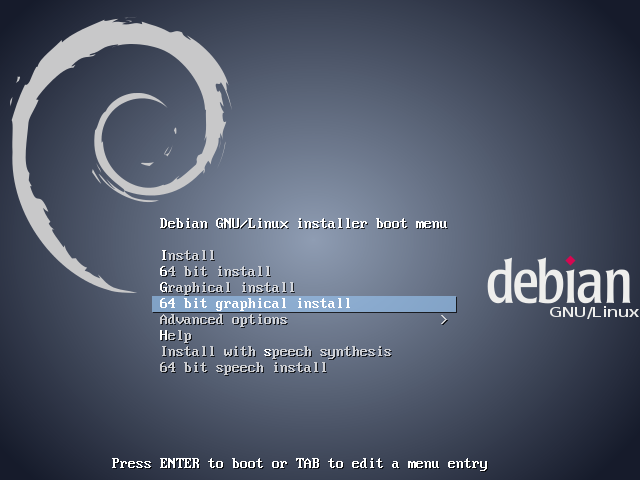

Pastikan anda memilih ``64 bit graphical install`` dengan mengarahkan arah
panah turun pada papan ketik anda.

Pemilihan Bahasa
~~~~~~~~~~~~~~~~

Pada tahap selanjutnya kita akan diarahkan untuk menggunakan bahasa yang
akan digunakan untuk pemasangan dan sistem pada umumnya. Pada pembahasan
kali ini kita akan mengguanakn **Bahasa Indonesia** pada saat pemasangan.

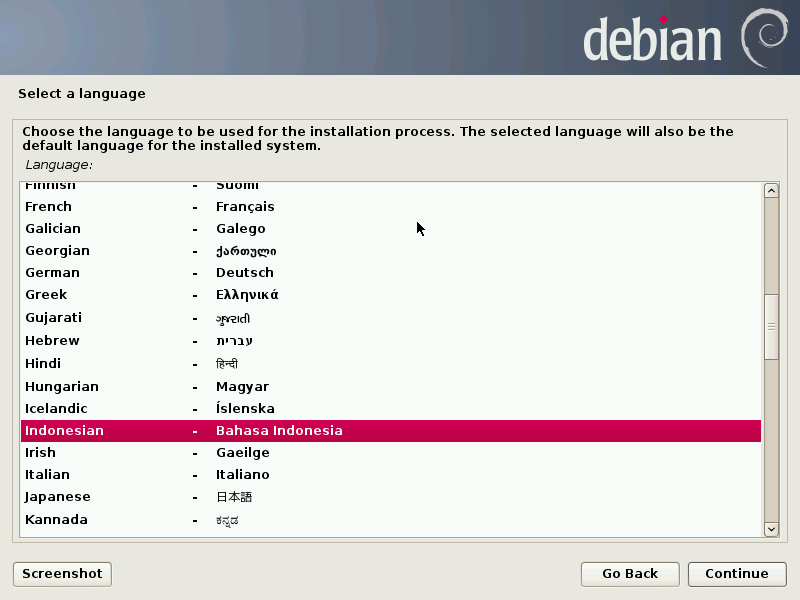

Menentukan lokasi
~~~~~~~~~~~~~~~~~

Pada tahap selanjutnya kita akan diarahkan untuk memberikan informasi
lokasi saat ini. Penting bagi kita untuk memilih lokasi nyata dikarenakan
kita akan di arahkan pada zona waktu yang tepat.

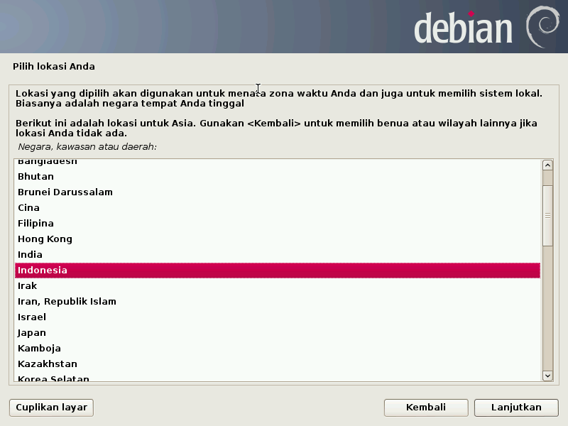

Menentukan papan ketik yang kita gunakan
~~~~~~~~~~~~~~~~~~~~~~~~~~~~~~~~~~~~~~~~

Untuk penggunaan papan ketik yang beredar di Indonesia, peta tombol yang
umum adalah Inggris Amerika. Jadi kita pilih **Inggris Amerika**

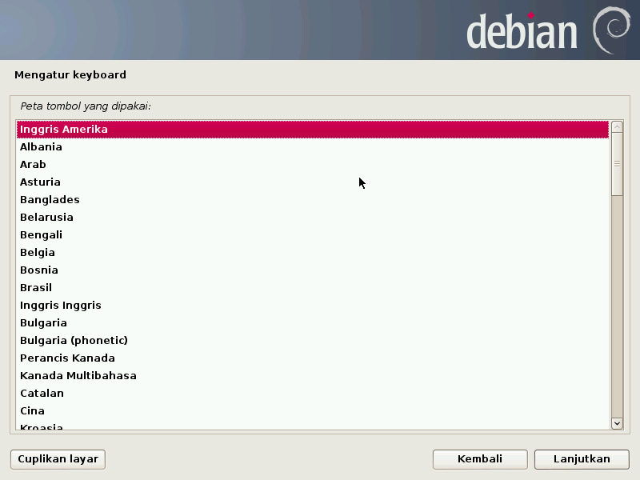
..    :width: 550px
..    :height: 413px

Pengaturan Jaringan
~~~~~~~~~~~~~~~~~~~

Pada tahap selanjutnya kita akan diberikan pilihan pengaturan jaringan,
jika anda berada dibawah jaringan yang menggunakan DHCP Server maka anda
tidak perlu melakukan apapun. Karena secara default sistem akan mendapatkan
IP dari server DHCP. Jika menggunakan DHCP maka tampilan sukses akan nampak 
seperti gambar dibawah ini.

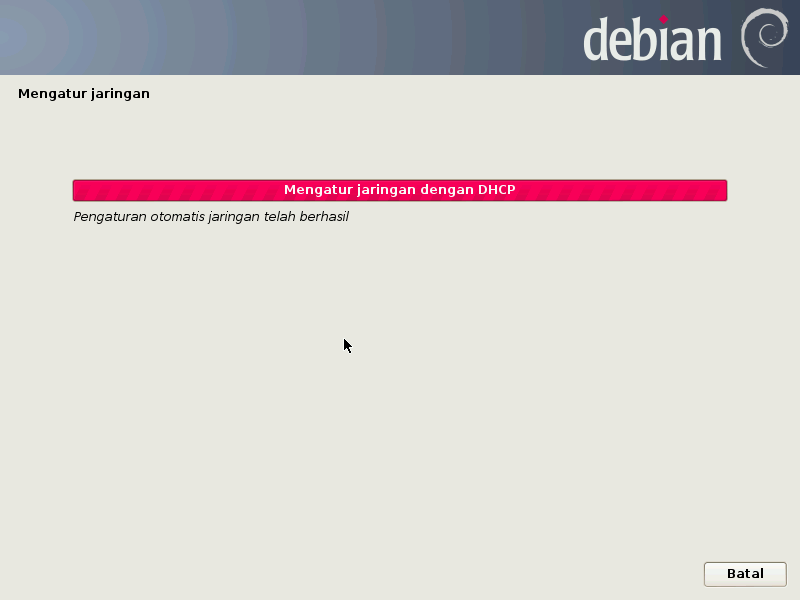
..    :width: 550px
..    :height: 413px

Namun jika anda tidak mempunyai server DHCP di jaringan, maka akan nampak
peringatan bahwa pengaturan otomatis gagal. Namun jangan panik, sillakan
klik ``Lanjutkan``. Seperti pada gambar dibawah ini.

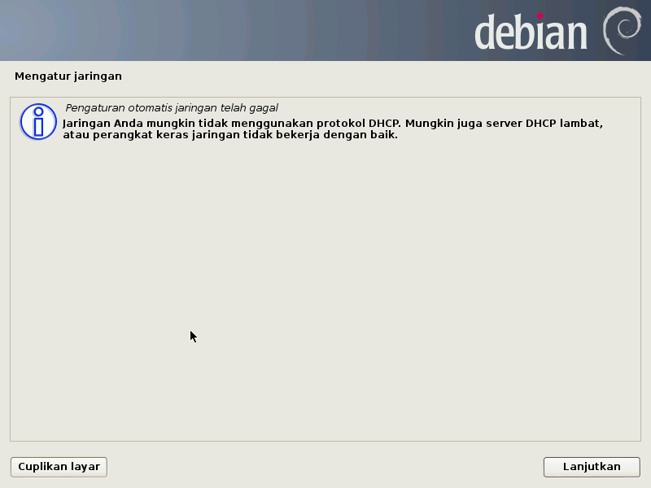

Langkah selanjutnya adalah menentukan informasi alamat IP, subnet IP, gateway
IP dan informasi server DNS. Jika anda tidak tahu ind=formasi tersebut, silakan
bertanya pada administrator jaringan anda.

Untuk tahap penentuan IP seperti yang nampak pada gambar dibawah ini, silakan
pilih ``Atur jaringan secara Manual`` atau ``Jangan mengatur jaringan saat ini``
bila anda belum mempunyai informasi akurat.

.. note:: jika anda memilih untuk mengatur jaringan pada saat nanti, silakan
    merujuk pada halaman :ref:`Pengaturan jaringan secara manual <atur-jaringan-manual>`.

.. image:: images/install/grafis5-2.png

Selanjutnya silakan masukkan alamat IP anda, anda juga dapat memasukkan alamat 
IPv6 jika anda tidak mempunyai alamat IP (IPv4). Pada bab sebelumnya kita telah
menentukan IP, yaitu 192.168.0.100

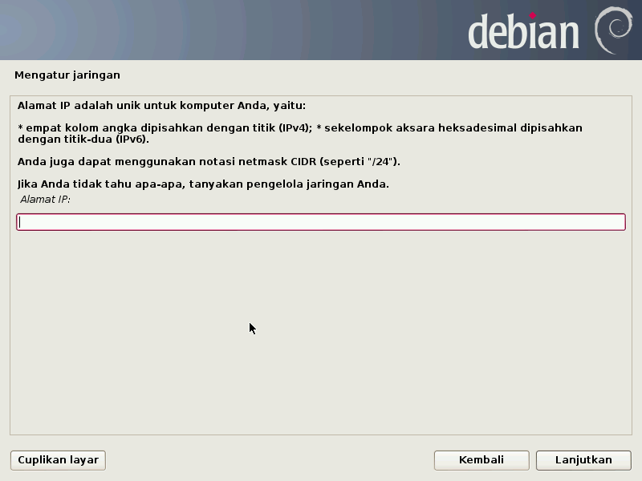

Tahap selanjutnya adalah memasukkan subnet dari jaringan anda, pada umumnya
jaringan mempunyai subnet /24 atau netmask 255.255.255.0, namun kadang berbeda
tergantung dengan pengaturan dari administrator jaringan.

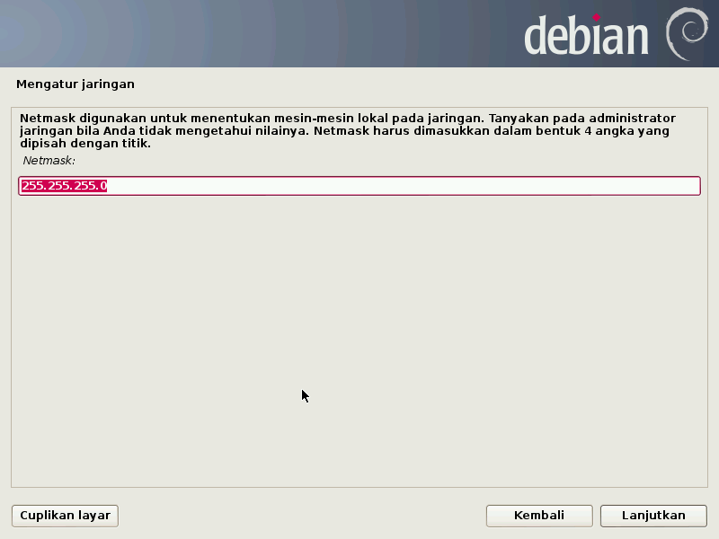

Tahap selanjutnya adalah memberikan informasi gateway yang kita gunakan di
jaringan kita, pada umumnya gateway mempunyai ip terkecil di jaringan. Namun
bisa berbeda bila administrator jaringan mempunyai pengaturan lain.

Silakan mengisikan dengan 192.168.0.1

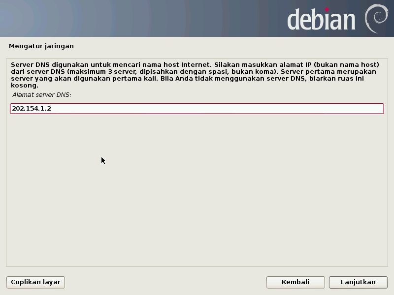

Tahap selanjutnya adalah memberikan informasi server DNS yang akan digunakan.
Untuk amannya, silakan isikan ``8.8.8.8 8.8.4.4``.

Pengaturan Domain
~~~~~~~~~~~~~~~~~

Langkah selanjutnya adalah memberikan informasi domain yang ada dalam jaringan
kita, anda dapat mengosongkan bila anda tidak tahu domain yang ada pada jaringan
anda.

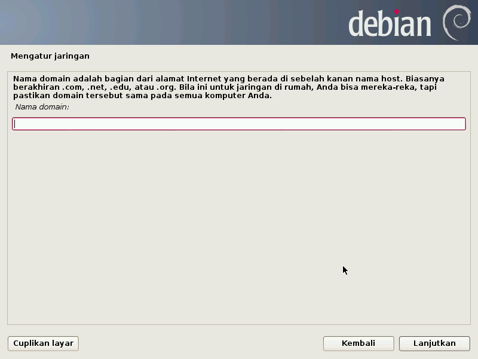

Pembuatan akun root
~~~~~~~~~~~~~~~~~~~

Langkah selanjutnya adalah pembuatan pengguna root, root adalah pengguna dengan
level kuasa tertinggi di linux. Anda tidak bisa mengubah namauser root, namun
anda dapat menentukan kata sandi dari root.

Pada penentuan kata sandi root, mohon dipertimbangkan untuk menggunakan kata
sandi yang tidak mudah ditebak, seperti penggunaan kombinasi dari huruf, angka,
tanda baca, dan spasi. Beberapa kata sandi yang luamayan rumit adalah ``Jl.
Jend. Sudirman No 43, belok kanan``.

Semakin rumit kata sandi semakin susah untuk ditebak dan semakin aman. Mohon
agar kata sandi ini dirahasiakan dari pengguna lain.

.. image:: images/install/grafis7.png

Membuat akun biasa
~~~~~~~~~~~~~~~~~~

Dalam instalasi Debian, kita akan membuat dua akun yaitu root yang mempunyai
kuasa tertinggi dan pengguna biasa. Pengguna biasa ini yang akan kita
gunakan dalam keseharian, dan **sangat** tidak disarankan untuk menggunakan
pengguna root sebagai penggunaan sehari-hari. Pada tahap ini kita akan
memasukkan nama lengkap kita dan nama user, untuk nama user anda dapat
menggunakan nama panggilan atau singkatan. Mohon jangan menggunakan
nama admin karena user admin sudah ada di sistem debian sejak rilis squeeze.

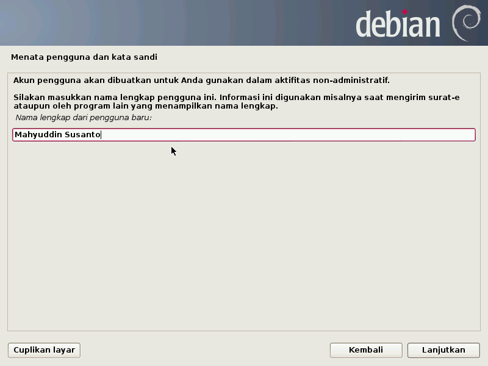
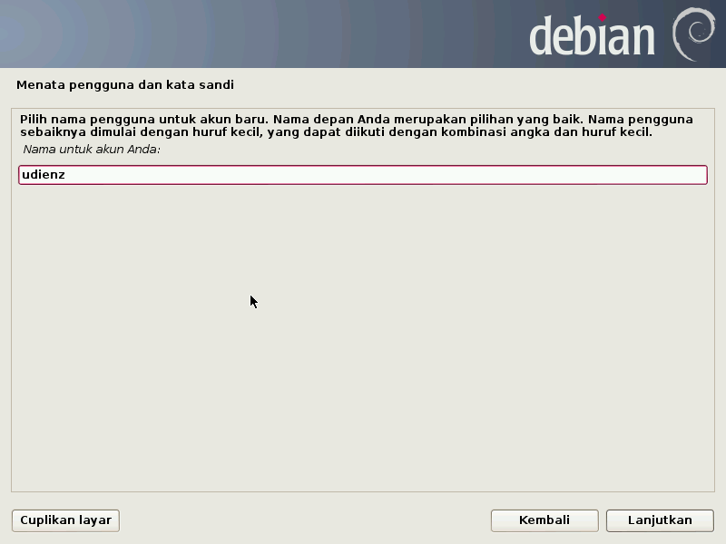

Langkah selanjutnya adalah penentuan kata sandi, seperti root usahakan
menentukan passwordnya tidak mudah ditebak.

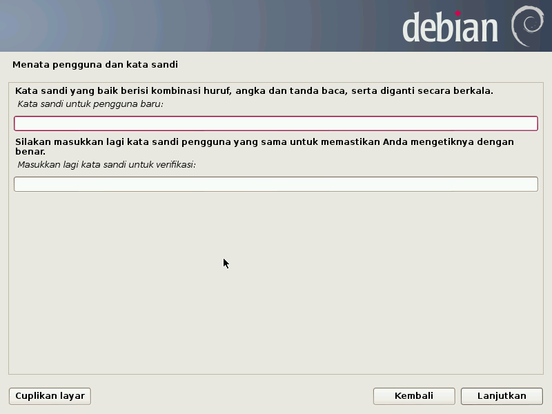

Mengator Zona Waktu
~~~~~~~~~~~~~~~~~~~

Langkah selanjutnya adalah menentukan zona waktu, dikarenakan penulis berada
di pulau Jawa, maka disini penulis memilih ``WIB (Sumatra, Jakarta, Jawa
Kalbar, dan Kalteng)``

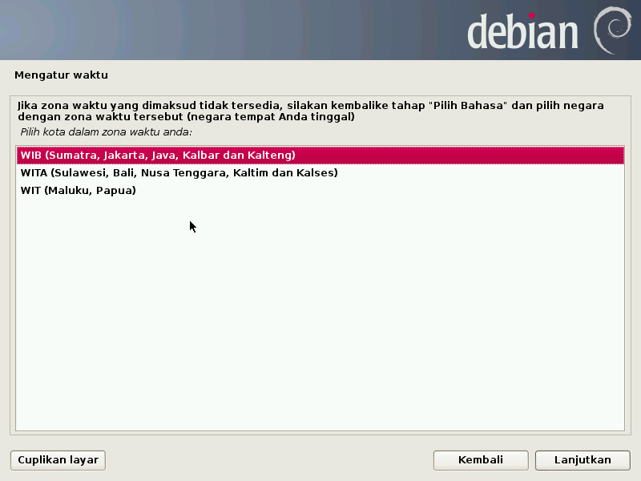

Pengaturan Partisi Harddisk
~~~~~~~~~~~~~~~~~~~~~~~~~~~

Tahap selanjutnya adalah pemartisi harddisk, pada saat pengaturan harddisk
ini mohon melakukan dengan sangat hati-hati. Hal ini dikarenakan banyak
kasus hilangnya data pada harddisk karena memlih opsi salah.

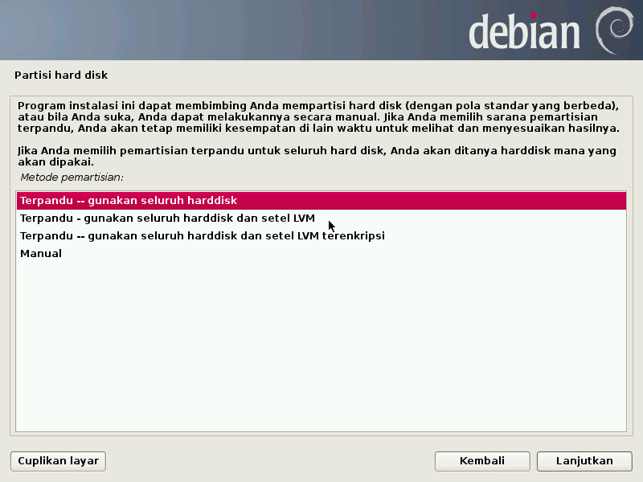

Ada empat pilihan yang tersedia, yaitu:

 - ``Terpandu -- gunakan seluruh harddisk``, opsi ini bisa dipilih dengan 
   syarat **tidak ada** data lain dalam harddisk.
 - ``Terpandu -- gunakan seluruh harddisk dan setel LVM``, opsi ini sama
   dengan sebelumnya, hanya harddisk akan menggunakan teknologi LVM
   (Logical Volume Manager)
 - ``Terpandu -- gunakan seluruh harddisk dan setel LVM terenkripsi``, opsi
   ini sama dengan sebelumnya hanya di tambahkan opsi enkripsi yang
   menyediakan tingakat kemanan ketika hardisk anda hilang atau tercuri
   kemudian ada yang mencoba untuk melihat isi harddisk. Jika menggunakan
   opsi ini maka orang yang akan melihat data di harddisk tidak akan bisa
   melihat isi harddisk karena adanya enkripsi.
 - Manual, opsi ini digunakan apabila anda mempunyai data di dalam harddisk 
   anda. Ini penting untuk menghindari penghapusan data di harddisk. Untuk
   instalasi dual boot sialakan memilih ini.

Pada panduan ini, kita memilih opsi ``Terpandu -- gunakan seluruh harddisk``
untuk memudahkan instalasi.

Langkah selanjutnya adalah menentukan harddisk yang akan dipasang sistem
Debia. Jika anda memiliki satu harddisk maka yang nampak hanya satu saja,
namun jangan panik, memang seharusnya nampak seperti itu.

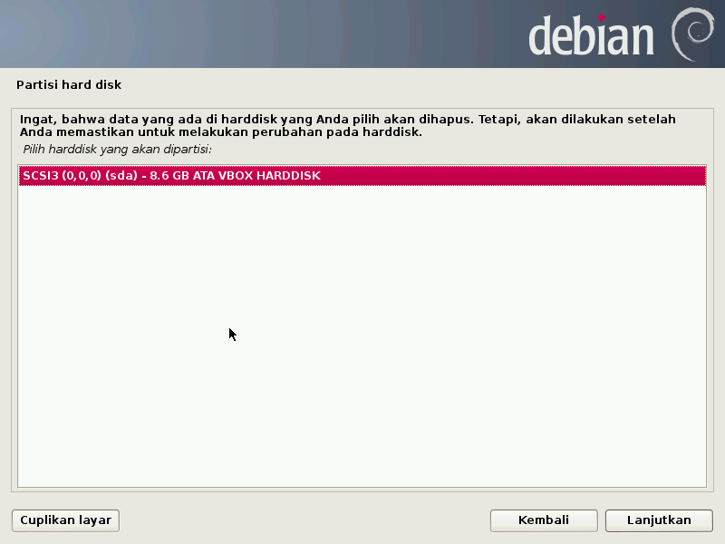

Menentukan Titik Kait Partisi Harddisk
~~~~~~~~~~~~~~~~~~~~~~~~~~~~~~~~~~~~~~

Setelah berhasil melewati proses partisi harddisk, langkah selanjutnya
adalah menentukan titik kait partisi kedalam direktori. Berbeda dengan
Windows, Linux mempunyai spesifikasi berbeda. Jika di Windows ada ``Drive
C:`` maka di Linux tidak ada hal ini dikarenakan root mempunyai topologi
pohon dan ranting, atau direktori terstruktur.

Berikut adalah penjelasan direktori yang ada di dalam Linux:

- /, adalah direktori tertinggi dari Linux, tidak ada direktori diatas /.
  pengucapan / adalah root direktori. Root disini bukan pengguna root.
- /bin, adalah direktori yang berisikan perintah yang tersedia untuk mode
  pengguna tunggal (singel user mode).

.. note::
    single user mode adalah sebuah fasilitas dari kernel linux yang 
    memungkinkan kita untuk memuat kernel dan konsole dengan fasilitas 
    terbatas. Biasanya digunakan untuk pemeliharaan siste yang tidak perlu 
    memuat seluruh servis di sistem.

- /boot, berisikan berkas-berkas untuk boot loader seperti kernel dan 
  initrd.
- /dev, berisikan informasi hardware. Seperti informasi partisi harddisk,
  modem, perangkat USB, dan lain-lain.
- /etc, berisikan berkas-berkas pengaturan sistem, yang berarti semua
  pengaturan sistem berada disini.
- /home, berisikan direktori pengguna selain root, di sini pengguna dapat
  meyimpan berkas-berkasnya di sini.
- /lib, berisikan pustaka yang diperlukan oleh periintah-perintah biner dari
  /bin dan /sbin
- /media, merupakan titik kait dari *removable media* seperti CD-RIM, USB 
  Flash disk.
- /mnt, merupakan titik kait sementara, hampir mirip dengan /media
- /opt, adalah tempat aplikasi biasanya disimpan, biasanya aplikasi yang
  menyimpan disini adalah aplikasi yang bukan bawaan dari Debian.
- /proc, merupakan sistem berkas virtual yang berisikan informasi tentang
  proses dan informasi kernel. 
- /root, adalah direktori milik pengguna root.
- /sbin, berisikan berkas-berkas biner yang hanya bisa dieksekusi oleh root.
- /srv, direktori opsional yang biasanya digunakan untuk menyimpan data-data
  yang disediakan oleh layanan server.
- /tmp, adalah direktori sementara yang digunakan untuk menyimpan berkas.
  Berkas yang berada di /tmp akan hilang jika sistem reboot atau dimatikan.
- /usr, berisikan data dari sistem yang terdapat banyak peralatan dan
  aplikasi dari pengguna. Pada umumnya Debian menggunakan direktori ini
  untuk menyimpan data aplikasi, berkas biner dan informasi paket lainya.
- /var, berisikan berkas-berkas milik sistem dan pengguna, karakteristik
  berkas-berkas disini adalah sering terjadinya perubahan. Seperti berkas
  log, berkas sementara email, cron, dan lain-lain.
- /run, berisikan informasi layanan sistem yang berjalan selama boot.

Silakan merujuk ke :ref:`Bab 4 tentang sistem berkas di Debian
<sistem-berkas-di-debian>`. Pada langkah ini, silakan memilih opsi ``Partisi
/home yang terpisah``. Seperti pada gambar dibawah ini:

Kita memilih untuk memisahkan partisi /home dari / untuk mengantisipasi
hilangnya data ketika kuta melakukan format ulang.

.. note::
    Ingat bahwa data user selain root akan disimpan di folder /home/namauser

Pada langkah selanjutnya kita akan diperlihatkan review dari partisi yang
diterapkan di sistem Debian. Seperti yang nampak pada gambar dibawah ini

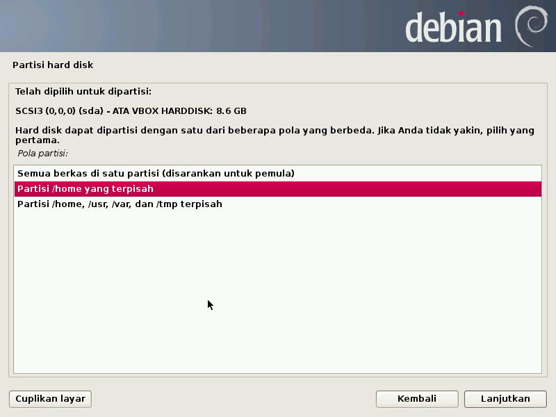

Silakan memilih opsi ``Selesai mempartisi dan tulis perubahan-perubahanya
ke harddisk``. Lalu tekan lanjutkan.

Dan konformasi ulang sekali lagi dengan memilih pilihan ``Ya`` pada 
tampilan berikutnya.

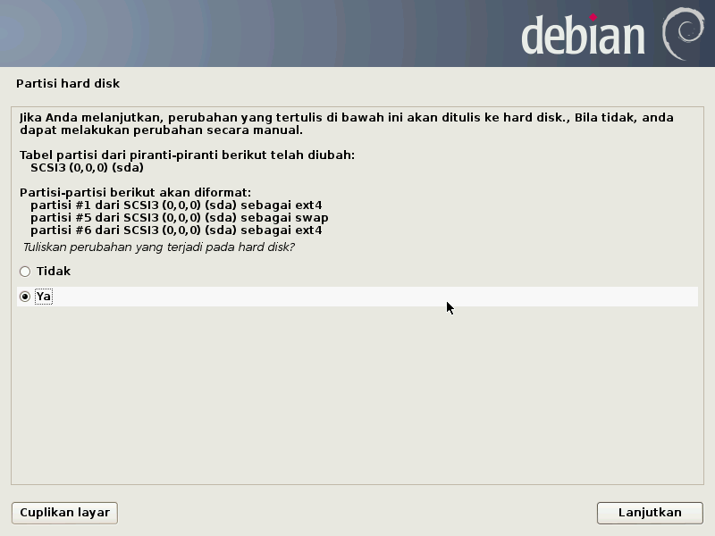

Menentukan server penyedia arsip Debian
~~~~~~~~~~~~~~~~~~~~~~~~~~~~~~~~~~~~~~~

Tahap pemasangan selanjutnya adalah penambahan paket-paket, dikarenakan kita
menggunakan netinstall, maka kita dianjurkan untuk menambahkan web penyedia
arsip paket Debian. Pada tampilan layar kita akan ditanya negara letak
server penyedia arsip Debian.

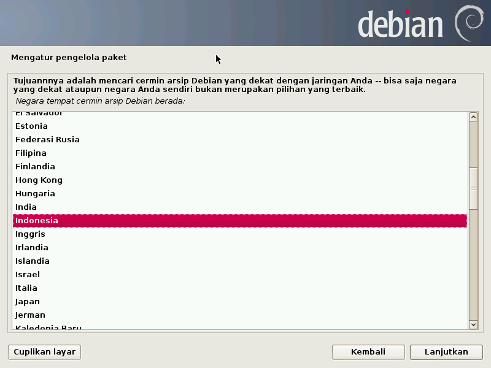

Pada pilihan ini kita akan memilih negara kita, hal ini dikarenakan di
Indonesia sudah mempunyai server penyedia arsip debian sendiri. Silakan klik
``Lanjutkan`` untuk memulai tahap instalasi selanjutnya.

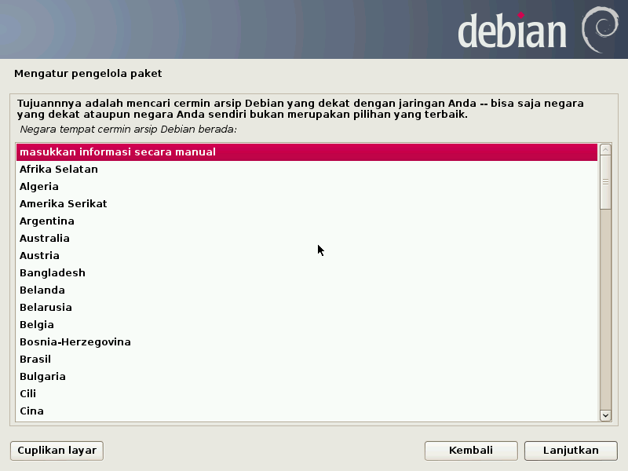

Dikarenakan server penyedia arsip debian di indonesia belum dimasukkan ke
dalam arsip resmi debian, maka kita akan memasukkan informasinya secara 
manual.

.. note:: Server penyedia arsip Debian resmi mempunyai domain dibawah domain
    debian.org dnegan format ftp.XX.debian.org, XX digantikan dengan dua
    digit negara. Contoh untuk Taiwan maka server resminya adalah
    ftp.tw.debian.org

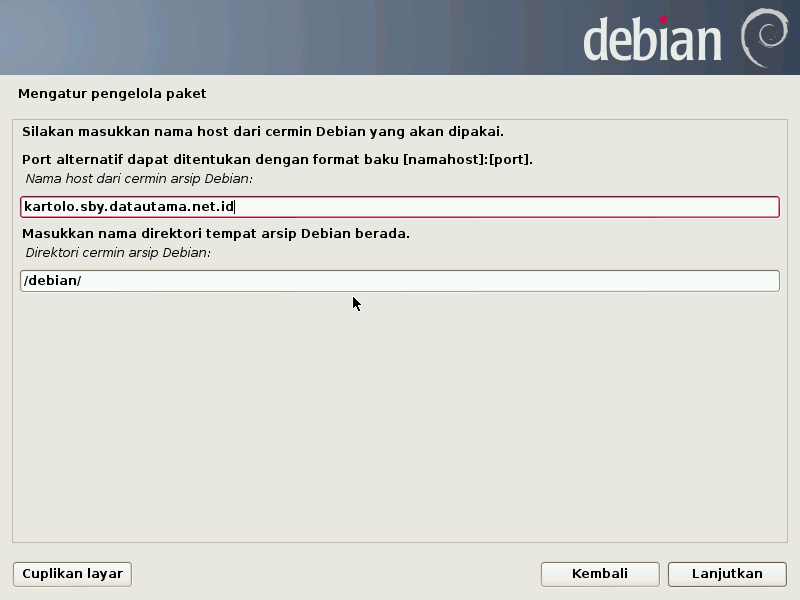

Pada tampilan selanjutkan kita akan memasukkan informasi server penyedia
arsip debian. Pada penduan ini kita menggunakan server `Datautama
<http://kartolo.sby.datautama.net.id>`_. Maka kita akan mengisikan 
informasinya seperti pada gambar diatas.

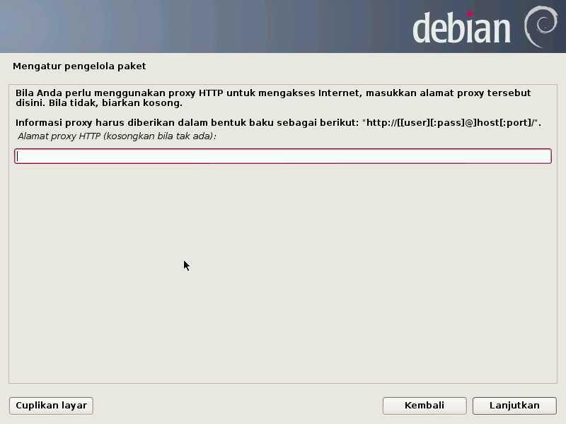

Pada tahap selanjutnya kita akan ditanya, apakah kita akan menggunakan
server proxy untuk melakukan sambungan ke server arsip debian. Silakan kosongkan
apabila anda tidak mempunyai proxy dan ketik ``Lanjutkan``.

Popularity Contest
~~~~~~~~~~~~~~~~~~

Pada tahap selanjutnya kita akan ditanya apakah kita akan berpartisipasi pada
pengumpulan statistik paket-paket yang sering di pasang. Sangat dianjurkan untuk
memilih ``Ya``, dikarenakan kita akan emngirimkan umpan balik statistik paket
kita ke Debian dan para pengembang Debian dapat mengevaluasinya.

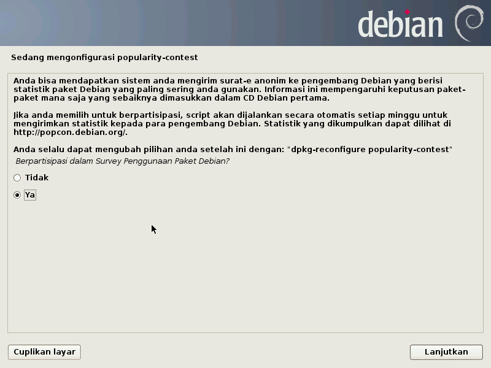

Pemilihan paket
~~~~~~~~~~~~~~~

Pada tampilan selanjutnya kita akan ditanya untuk memasang daftar paket apa saja
yang akan dipasang di sistem kita.

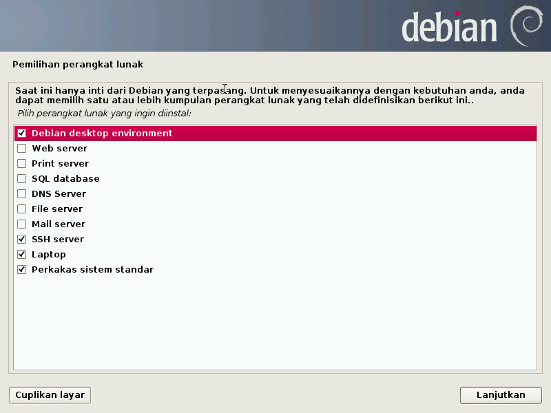

Pada tahap ini kita akan memasang daftar paket Desktop, SSH Server (opsional
pada kali ini lihat :ref:`Memasang SSH Server <memasang-ssh-server>`), Laptop,
dan sistem umum.

Setelah kita klik ``Lanjutkan``, maka sistem akan melakukan pengunduhan
paket dari server penyedia arsip Debian yang sudah kita tentukan sebelumnya.
Lamanya tahap ini tergantung pada koneksi anda.

Pemasangan Boot Loader
~~~~~~~~~~~~~~~~~~~~~~

Tahap selanjutnya adalah pemasangan boot loader, yang berguna untuk memulai
sistem sesaat setelah komputer melakukan booting.

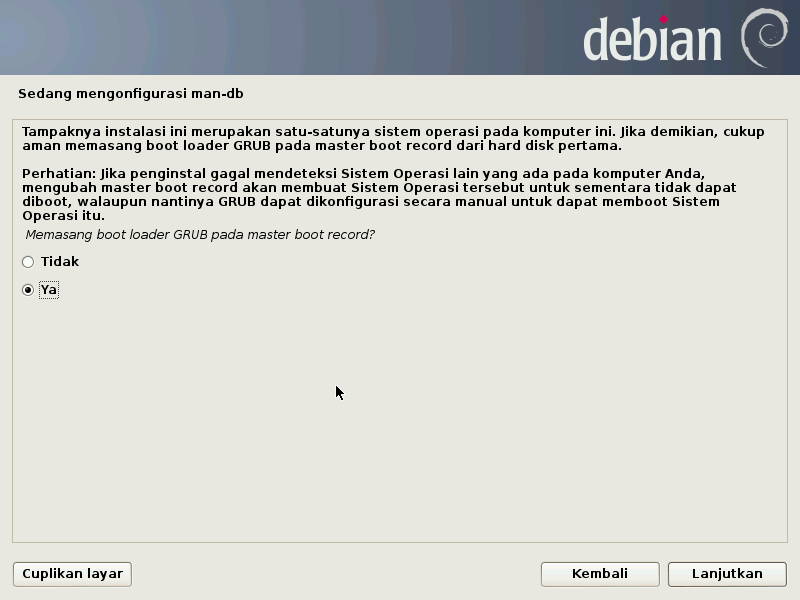

Tahap akhir
~~~~~~~~~~~

Pada tahap ini, instalasi telah dilakukan dan selesai. pastikan anda mengeluarkan
media instalasi sehingga sistem dapat boot ke Debian.

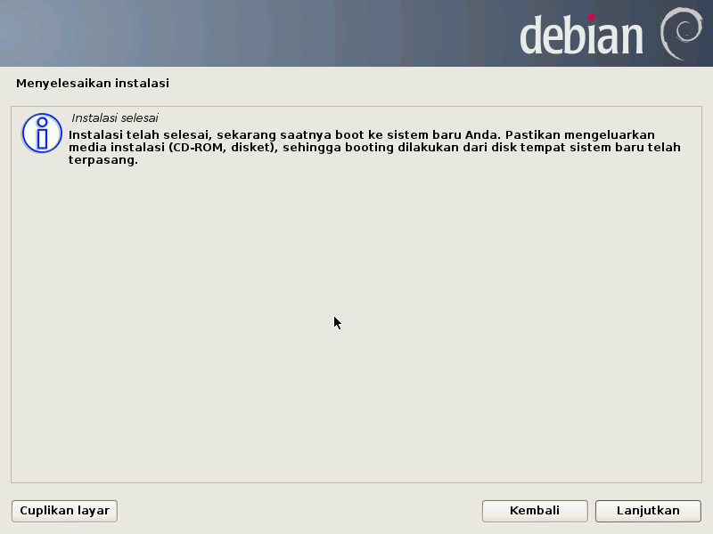

Halaman login
~~~~~~~~~~~~~

Berikut adalah tampilan halaan login pada Debian yang dihasilkan dari pemasangan
yang baru saja kita lakukan

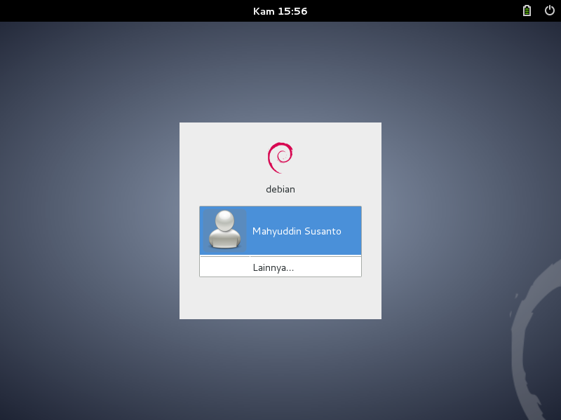

.. _memasang-ssh-server:

Memasang SSH Server
----------------------

Jika anda kelupaan untuk memilih ``SSH server`` pada saat pemasangan sistem tadi,
kita dapat memasangnya secara manual dengan cara::

	apt-get install ssh openssh-server

Mulai sekarang kita dapat melakukan koneksi ssh dari system kita ke mesin Debian Server.
Bagi yang menggunakan sistem linux, dapat melakukan koneksi ssh dengan membuka ``x-terminal-emulator``
dengan mengetikkan::
	
	ssh administrator@192.168.0.100

Jika kita menggunakan Windows, maka kita harus mengunduh putty untuk melakukan remote,
untuk mengunduh putty bisa diunduh dari `sini <http://the.earth.li/~sgtatham/putty/latest/x86/putty.exe>`_

.. _atur-jaringan-manual:

Pengaturan jaringan
---------------------

Dikarenakan sistem Debian kita saat instalasi mendapatkan ip dari DHCP, kita 
harus mengubahnya ke IP statik untuk mencegah server mendapatkan IP berbeda suatu
saat nanti.

Sunting ``/etc/network/interfaces`` dan isikan parameter-parameter yang akan kita butuhkan.
Dalam hal ini kita akan menggunakan ip 192.168.0.100). Silakan buat pengaturannya sebagai berikut::

	vim /etc/network/interfaces

	# The loopback network interface
	auto lo
	iface lo inet loopback

	# The primary network interface
	#allow-hotplug eth0
	#iface eth0 inet dhcp
	auto eth0
	iface eth0 inet static
	address 192.168.0.100
	        netmask 255.255.255.0
        	network 192.168.0.0
	        broadcast 192.168.0.255
        	gateway 192.168.0.1

Kemudian simpan dan lakukan perintah berikut::
	
	/etc/init.d/networking restart

Cek dengan perintah berikut::

	ifconfig eth0
	eth0      Link encap:Ethernet  HWaddr 84:8f:69:ab:0a:cd  
		  inet addr:192.168.0.100  Bcast:192.168.0.255  Mask:255.255.255.0
		  inet6 addr: fe80::868f:69ff:feab:acd/64 Scope:Link
		  UP BROADCAST RUNNING MULTICAST  MTU:1500  Metric:1
		  RX packets:531197 errors:0 dropped:24 overruns:0 frame:0
		  TX packets:347439 errors:0 dropped:0 overruns:0 carrier:1
		  collisions:0 txqueuelen:1000 
		  RX bytes:692756549 (692.7 MB)  TX bytes:37837233 (37.8 MB)
		  Interrupt:50 

.. _CD Netinstall: http://kartolo.sby.datautama.net.id/debian-cd/current/amd64/iso-cd/debian-6.0.6-amd64-netinst.iso
