================
Instalasi Debian 
================

Untuk menggunakan Debian, kita harus menginstall terlebih dahulu di
komputer kita.


Kebutuhan minimal
--------------------

Setelah anda mendapatkan informasi tentang perangkat keras komputer anda,
pastikan bahwa perangkat keras anda mendukung instalasi yang akan anda
inginkan.

Dari tabel dibawah mungkin anda akan membutuhkan kelas yang lebih rendah,
tergantung dari kebutuhan anda. Namun banyak dari pengguna menghindari resiko frustasi
jika mereka menghiraukan saran ini.

Sistem Pentium 4 1 GHz adalah rekomendasi minimum untuk sistem desktop.

+-----------------+---------------+-------------------+------------+
| Jenis instalasi | RAM (minimal) | RAM (rekomendasi) | Hard Disk  |
+=================+===============+===================+============+
| tidak dg desktop| 64 megabytes  | 256 megabytes     | 1 gigabyte |
+-----------------+---------------+-------------------+------------+
| dengan Desktop  | 128 megabytes | 512 megabytes     | 5 gigabytes|
+-----------------+---------------+-------------------+------------+

Media Instalasi
---------------

Debian mendukung instalasi dari berbagai media, ini sangat penting bagi
beberapa orang yang mempunyai kepentingan berbeda dalam pemasangan.

CD/DVD
~~~~~~

Menggunakan CD/DVD sangat umum untuk melakukan instalasi, hampir semua merek
CD/DVD sudah didukung oleh Debian, termasuk CD/DVD yang menggunakan ATA,
USB, Firmware. Dalam distribusi CD/DVD Debian terdapat
beberapa macam jenis CD/DVD Installer, yaitu:

 - CD/DVD Installer umum: Berisikan paket-paket umum Debian, seperti paket
   desktop, editor dan multimedia. Untuk instalasi Debian, kita hanya butuh
   CD pertama atau DVD pertama untuk instalasi.
 - CD Netinstall: Berisikan paket-paket minimal di Debian, jika kita
   menggunakan media ini untuk instalasi, kita akan mendapatkan system yang
   sangat bersih dan sedikit memakan harddsik.
 - Bussiness card: Hampir sama dengan Netinstall, namun perbedaan terletak
   pada tidak adanya sistem dasar. Jadi bila kita menggunakan media ini,
   maka kita harus mempunyai koneksi internet untuk mengunduh paket paket
   dasar.

Silakan melihat direktori :ref:`situs penyedia CD
Debian<mendapatkan-debian>` pada bab sebelumnya untuk memastikan.

USB Flash Disk
~~~~~~~~~~~~~~

Instalasi melalui Flash disk sangat dimungkinkan untuk instalasi Debian,
beberapa program menyediakan kemudahan untuk melakukan ini. Program tersebut
adalah unetbootin. Unetbootin mendukung tidak hanya Debian, namun distro
linux pada umumnya.

Jaringan
~~~~~~~~

Debian juga mendukung metode instalasi melalui jaringan dengan bantuan TFTP
dan PXE. 

.. note::
    Dalam tutorial ini kita menggunakan namahost server1.example.com dengan 
    IP 192.168.0.100 dan gateway 192.168.0.1. Pengaturan ini mungkin 
    berbeda dengan anda, jadi anda butuh menggantinya dengan yang anda 
    butuhkan. Untuk pemasangan, kita akan menggunakan CD netboot yang dapat 
    diunduh di `Cermin CD Debian
    di Indonesia <http://kartolo.sby.datautama.net.id/debian-cd/current/amd64/iso-cd/debian-6.0.6-amd64-netinst.iso>`_

Sistem dasar
------------

Masukkan CD Debian kedalam system dan boot dari CD. Pilih ``Install`` (ini akan
memulai instalasi berbasiskan text - jika anda menginginkan instalasi grafis,
pilih ``Graphical install``);

.. image:: images/install/1.png

Silakan pilih bahasa anda:


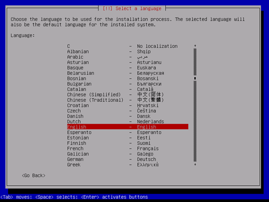

Kemudian pilih lokasi anda:


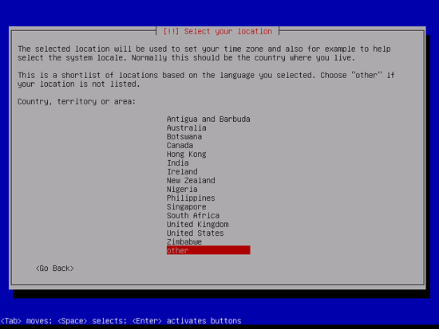

.. image:: images/install/4.png

.. image:: images/install/5.png

Jika anda memilih kombinasi bahasa dan lokasi yang tidak umum (dalam kasus saya, seperti
``bahasa inggris`` sebagai bahasa dan ``Indonesia``` sebagai lokasi), installer mungkin akan
memberitahu bahwa tidak ada locale yang terindikasi untuk kombinasi ini; dalam kasus ini anda
harus memilih locale secara manual. Saya memilih ``en_US.UTF-8``:

.. image:: images/install/6.png

Silakan pilih desain papan ketik:

.. image:: images/install/7.png

Installer akan memeriksa CD, hardware anda dan mangatur jaringan dengan DHCP
jika ada server DHCP di jaringan:

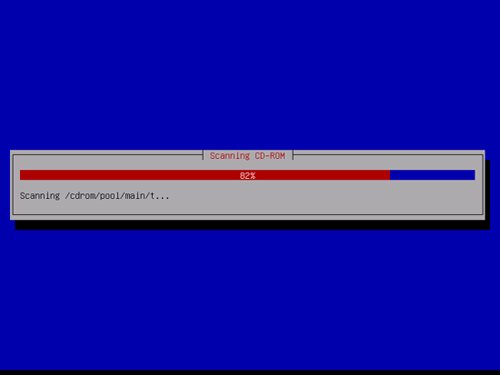

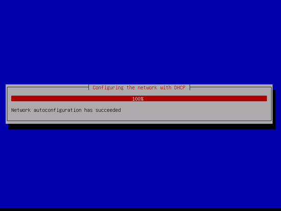

Masukkan namahost. Dalam contoh berikut, sistem saya dinamakan dengan ``server1.example.com``,
jadi saya akan memasukkan ``server1``:

.. image:: images/install/11.png

Masukkan nama domain anda. Dalam contoh ini, ``example.com``:

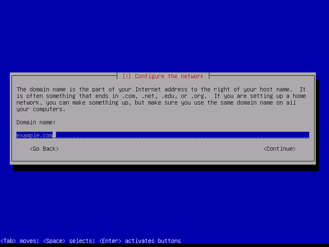

Setelah itu berikan kata sandi root:

.. image:: images/install/13.png

Ulangi kata sandi lagi untuk mencegah salah ketik:

.. image:: images/install/14.png

Buat akun user normal, untuk contoh ini menggunakan Administrator dengan nama user
``administrator`` (jangan gunakan nama ``admin`` karena namanya telah dipakai di
Debian Squeeze):

.. image:: images/install/15.png

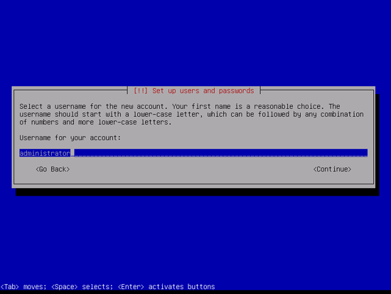

.. image:: images/install/17.png

Sekarang kita akan membuat partisi di harddisk. Untuk memudahkan kita akan membuat
satu partisi besat dengan titik kait / dan partisi kecil swap. Untuk itu kita pilih
``Guided - use entire disk``. Anda dapat memilih opsi lain jika anda paham apa yang anda lakukan.

.. image:: images/install/19.png

Pilih diska yang akan kita partisi:

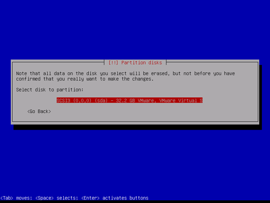

Langkah selanjutya akan memilih skema partisi. Seperti yang dijelaskan sebelumnya, kita memilih
``All files in one partition (recommended for new users)`` untuk kemudahan:

.. image:: images/install/21.png

Jika sudah selesai, pilih ``Finish partitioning and write changes to disk``:

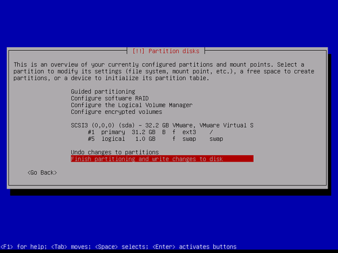

Pilih ``Yes`` jika anda di tanya ``Write changes to disks?``:

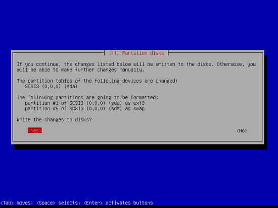

Setelah itu, partisi baru anda akan dibuat dan diformat:

.. image:: images/install/24.png

Sistem dasar sekarang lagi dipasang:

.. image:: images/install/25.png

Kemudian kita akan mengatur apt. Dikarenakan kita menggunakan `CD Netinstall`_
yang mengandung kumpulan paket Debian yang sangat minim. Kita harus menggunakan
cermin di jaringan/internet untuk mendapatkan kumpulan semua paket Debian. Silakan
pilih negara dimana terdapat cermin Debian:

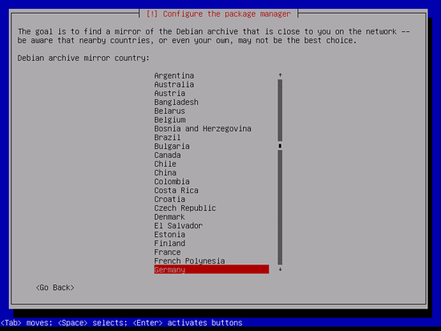

Kemudian pilih cermin yang akan digunakan (contoh ``ftp.de.debian.org``):

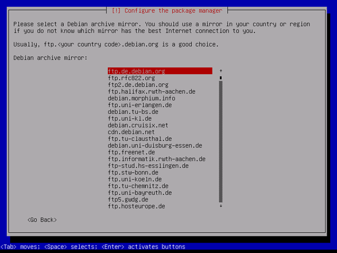

Jika anda tidak menggunakan HTTP Proxy,biarkan isian tersebut kosong dan tekan ``Continue``:

.. image:: images/install/28.png

Seakrang apt sedang memperbarui basis data paket:

.. image:: images/install/29.png

Kita dapat melewati survei penggunakan paket dengan memilih ``No``:

.. image:: images/install/31.png

Kita membutuhkan web server, dns server, dan basisdata MySQL tapi kita tidak akan
memilihnya sekarang karena kita ingin mengetahui paket apa saja yang akan dipasang
untuk keperluan server-server tersebut. Tentu kita akan memasang paket-paket tersebut secara manual.
Untuk kita pilih `Standard system utilities`` dan
``SSH server`` dan pilih ``Continue``:

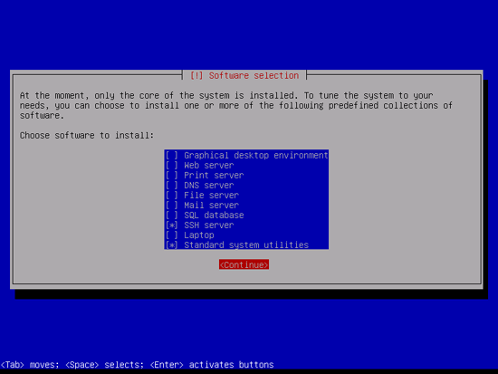

Paket-paket yang dibutuhkan akan diunduh dan dipasang ke sistem:

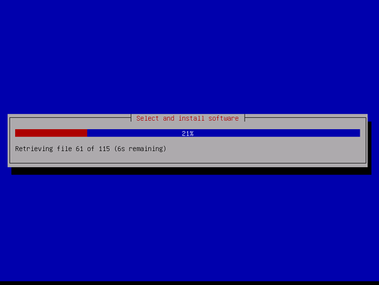

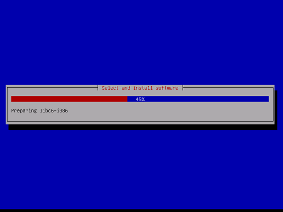

Ketika ditanya ``Install the GRUB boot loader to the master boot record?``, pilih
``Yes:````

.. image:: images/install/36.png

Pemasangan sistem dasar sudah selesai. Keluarkan `CD Netinstall`_ dari cdrom
dan pilih ``Continue`` untuk memuat ulang sistem:

.. image:: images/install/38.png

Memasang SSH Server
----------------------

Jika anda kelupaan untuk memilih ``SSH server`` pada saat pemasangan sistem tadi,
kita dapat memasangnya secara manual dengan cara::

	apt-get install ssh openssh-server

Mulai sekarang kita dapat melakukan koneksi ssh dari system kita ke mesin Debian Server.
Bagi yang menggunakan sistem linux, dapat melakukan koneksi ssh dengan membuka ``x-terminal-emulator``
dengan mengetikkan::
	
	ssh administrator@192.168.0.100

Jika kita menggunakan Windows, maka kita harus mengunduh putty untuk melakukan remote,
untuk mengunduh putty bisa diunduh dari `sini <http://the.earth.li/~sgtatham/putty/latest/x86/putty.exe>`_

Pengaturan jaringan
---------------------

Dikarenakan sistem Debian kita saat instalasi mendapatkan ip dari DHCP, kita 
harus mengubahnya ke IP statik untuk mencegah server mendapatkan IP berbeda suatu
saat nanti.


Sunting ``/etc/network/interfaces`` dan isikan parameter-parameter yang akan kita butuhkan.
Dalam hal ini kita akan menggunakan ip 192.168.0.100). Silakan buat pengaturannya sebagai berikut::

	vim /etc/network/interfaces

	# The loopback network interface
	auto lo
	iface lo inet loopback

	# The primary network interface
	#allow-hotplug eth0
	#iface eth0 inet dhcp
	auto eth0
	iface eth0 inet static
	address 192.168.0.100
	        netmask 255.255.255.0
        	network 192.168.0.0
	        broadcast 192.168.0.255
        	gateway 192.168.0.1

Kemudian simpan dan lakukan perintah berikut::
	
	/etc/init.d/networking restart

Cek dengan perintah berikut::

	ifconfig eth0
	eth0      Link encap:Ethernet  HWaddr 84:8f:69:ab:0a:cd  
		  inet addr:192.168.0.100  Bcast:192.168.0.255  Mask:255.255.255.0
		  inet6 addr: fe80::868f:69ff:feab:acd/64 Scope:Link
		  UP BROADCAST RUNNING MULTICAST  MTU:1500  Metric:1
		  RX packets:531197 errors:0 dropped:24 overruns:0 frame:0
		  TX packets:347439 errors:0 dropped:0 overruns:0 carrier:1
		  collisions:0 txqueuelen:1000 
		  RX bytes:692756549 (692.7 MB)  TX bytes:37837233 (37.8 MB)
		  Interrupt:50 


.. _CD Netinstall: http://kartolo.sby.datautama.net.id/debian-cd/current/amd64/iso-cd/debian-6.0.6-amd64-netinst.iso
