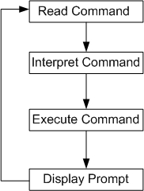
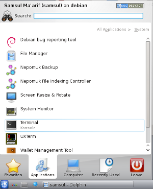
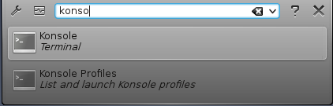
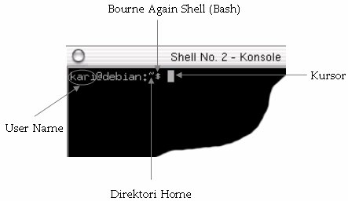
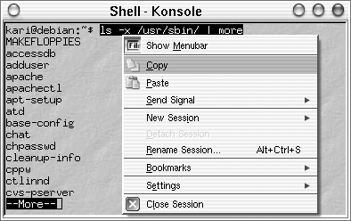
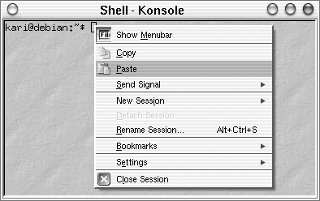
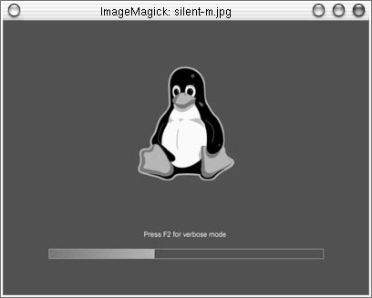

===========
Linux Shell
===========

Linux shell merupakan tool berbasis teks untuk berinteraksi dengan komputer.
Linux shell sering juga disebut dengan xterm, konsole, terminal, shell command,
ataupun shell. Shell ini merupakan antarmuka penghubung user dengan sistem.
Shell juga sering disebut dengan interpreter yang mengoperasikan sebuah loop
sederhana yakni menerima perintah, menginterpretasikan perintah, menjalankan
perintah, dan menunggu perintah masukan berikutnya. Berikut bagan loop
interpreter sederhana yang dijalankan oleh shell unix ataupun GNU/Linux.

Bab ini akan menjelaskan shell command yang sering digunakan oleh pengguna
UNIX ataupun GNU/Linux.

Alasan Mengapa Menggunakan Linux Shell
--------------------------------------

Pada sistem operasi seperti Ms-Windows dan MacOS, penggunaan shell
command sudah mulai dikurangi atau bahkan dihilangkan sama sekali. Pada
beberapa sistem operasi seperti yang penulis sebutkan di atas, para penggunanya
semakin dimanja dengan penggunaan mode grafis (Graphical desktop) dan tidak
memperdulikan lagi penggunaan shell command tersebut.

Satu hal yang menarik dari sistem operasi GNU/linux adalah penggunaan shell
command tetap dipertahankan karena beberapa alasan berikut:
1. Kebanyakan konfigurasi sistem dapat dilakukan dari shell command.
2. Linux shell memberikan fleksibilitas terutama saat anda bekerja dengan
banyak file.
3. Untuk tindakan penyelamatan terhadap sebuah data atau recovery terhadap
sistem dan pekerjaan maintenance sistem pada single mode dapat anda
lakukan lewat shell command.

Memulai Linux Shell
-------------------

Pada Start Menu – System – Konsole

Atau pada panel klik ikon konsole seperti yang tampak pada gambar berikut:

Selain itu, anda juga dapat menggunakan shortcut key Alt + F2 sehingga akan
tampak jendela dialog Run Command berikut:

Pada jendela dialog di atas ketikkan konsole kemudian klik opsi Run.
Selanjutnya akan tampak shell berikut.

Karakter \`$` pada konsole sering disebut dengan prompt shell - karakter ini
menandakan bahwa sistem siap menerima perintah masukan.

Pada distribusi Debian GNU/Linux, prompt shell selalu menyertakan nama
direktori tempat anda berada saat ini. Karakter \`~` menandakan bahwa anda saat
ini sedang berada pada direktori home. Jika prompt shell anda terdapat tanda \`#`
ini menandakan bahwa anda saat ini sedang login sebagai superuser/root.

Patut untuk dicatat bahwa setiap perubahan yang anda lakukan pada user ini
berarti anda akan merubah sistem secara keseluruhan (harus berhati-hati
terutama dalam menghapus file).

Setiap sistem GNU/Linux minimal memiliki satu buah program shell yakni bash.
Bash ini singkatan dari Bourne Again Shell – Bourne merupakan nama
pembuat program shell ini.

Berikut Kata kunci yang sering digunakan untuk command line:

+------------+----------------------------------------------------------------------+
| Kata Kunci | Deskripsi                                                            |
+============+======================================================================+
| [BkSp]     | Menghapus karakter ke arah kiri kursor                               |
+------------+----------------------------------------------------------------------+
| [Del]      | Menghapus karakter dari posisi kursor ke arah kanan                  |
+------------+----------------------------------------------------------------------+
| [Enter/RET]| Eksekusi perintah yang ditulis pada shell                            |
+------------+----------------------------------------------------------------------+
| C-d        | Fungsinya sama dengan [Del]                                          |
+------------+----------------------------------------------------------------------+
| C-e        | Memindahkan kursor ke posisi akhir                                   |
+------------+----------------------------------------------------------------------+
| C-k        | Menghapus perintah yang diketikkan ke shell mulai dari posisi kursor |
+------------+----------------------------------------------------------------------+
| C-l        | Membersihkan layar shell/terminal                                    |
+------------+----------------------------------------------------------------------+
| C-u        | Menghapus seluruh perintah yang diketikkan ke shell                  |
+------------+----------------------------------------------------------------------+

Perintah tambahan yang sering digunakan pada shell/terminal, yaitu:
-------------------------------------------------------------------

**Mencari perintah terakhir yang anda masukkan dengan inisial tertentu**

::

	kari@debian:~$ C-r
	(reverse-i-search)'` : h

Keluaran yang dihasilkan pada shell::

	kari@debian:~$ echo selamat datang

**Menampilkan semua pekerjaan yang anda lakukan pada konsole/shell**

::

	kari@debian:~$ jobs

**Menampilkan daftar perintah yang anda ketikkan sebelumnya**

::

	kari@debian:~$ history

**Mencari perintah dengan inisial tertentu**::

	kari@debian:~$ history | grep nama_perintah

Misal::

	kari@debian:~$ history | grep clear

Perintah di atas akan menampilkan seluruh perintah \`clear` yang pernah anda
jalankan sebelumnya.

**Menampilkan Isi Direktori**

Untuk menampilkan isi dari sebuah direktori, anda dapat menggunakan perintah
\`ls` diikuti dengan opsi yang anda inginkan. Pada buku kami sebelumnya
(Debian GNU/Linux-red) telah dijelaskan sebagian opsi yang dapat disertakan
pada command line \`ls`. Untuk materi ini penulis akan melengkapi contoh
penggunaaan \`ls` seperti berikut ini.

**Menampilkan isi direktori termasuk direktori/file hidden**

::

	kari@debian:~$ ls -a <direktori>

Misal::

	kari@debian:~$ ls -a /home/kari/

Keluaran perintah di atas adalah::

	.
	..
	.AbiSuite
	.DCOPserver_debian
	.ICEauthority
	.MCOP-random-seed
	.gphoto
	.gtk_themes
	.gtkrc-kde
	.kde3
	buku debian gnu jilid 2

**Menampilkan isi direktori/file dimana direktori akan ditampilkan dengan warna**

::

	kari@debian:~$ ls --color <direktori>

Misal::

	kari@debian:~$ ls --color /home/kari/Projects

**Menampilkan isi direktori beserta tipe file/direktori yang dimiliki**

::

	kari@debian:~$ ls --classify (atau -F) <direktori>

Misal::

	kari@debian:~$ ls --classify /usr/sbin/

Output perintah di atas adalah::

	MAKEFLOPPIES*
	ab*
	accessdb*
	adduser*
	addgroup@
	data/

Keterangan::

	* executable files
	@ symbolic links
	/ directory

**Menampilkan direktori beserta subdirektori yang terdapat di dalamnya**

::

	kari@debian:~$ ls --recursive (atau -R) <direktori>

Misal::

	kari@debian:~$ ls --recursive /home/kari

Output perintah di atas adalah::

	./Desktop/Trash:
	./MyMusic:
	./OpenOffice.org1.1.0:
	LICENSE
	LICENSE.html
	README
	./OpenOffice.org1.1.0/share/cde/types/ru.ANSI-1251:
	calc.dt
	calc.fp
	draw.dt
	draw.fp

**Menampilkan direktori/file dari yang terakhir kali dimodifikasi**

::

	kari@debian:~$ ls -t <direktori>

Misal::

	kari@debian:~$ ls -t /home/kari/

Output perintah di atas adalah::
	
	Data.txt	Projects
	Desktop		kde
	Aplikasi	MyMusic

**Mengurutkan direktori/file sesuai dengan ekstensi file/direktorinya**

::

	kari@debian:~$ ls -X <direktori>

Misal::

	kari@debian:~$ ls -X /home/kari/

Output perintah di atas adalah::
	
	Desktop			data presentasi
	MyMusic			gambar debian gnulinux
	Projects		kde
	Aplikasi		openoffice.org
	Buku debian jilid 2	data.txt

**Identifikasi Tipe Direktori**

Untuk melihat tipe dari semua file yang ada di dalam sebuah direktori, perintah
yang digunakan adalah::

	kari@debian:~$ file --help

	Usage: file [OPTION...] [FILE...]
	Determine type of FILEs.

	      --help                 display this help and exit
	  -v, --version              output version information and exit
	  -m, --magic-file LIST      use LIST as a colon-separated list of magic
		                       number files
	  -z, --uncompress           try to look inside compressed files
	  -b, --brief                do not prepend filenames to output lines
	  -c, --checking-printout    print the parsed form of the magic file, use in
		                       conjunction with -m to debug a new magic file
		                       before installing it
	  -e, --exclude TEST         exclude TEST from the list of test to be
		                       performed for file. Valid tests are:
		                       ascii, apptype, compress, elf, soft, tar, tokens, troff
	  -f, --files-from FILE      read the filenames to be examined from FILE
	  -F, --separator STRING     use string as separator instead of `:'
	  -i, --mime                 output MIME type strings (--mime-type and
		                       --mime-encoding)
	      --apple                output the Apple CREATOR/TYPE
	      --mime-type            output the MIME type
	      --mime-encoding        output the MIME encoding
	  -k, --keep-going           don't stop at the first match
	  -l, --list                 list magic strength
	  -L, --dereference          follow symlinks (default)
	  -h, --no-dereference       don't follow symlinks
	  -n, --no-buffer            do not buffer output
	  -N, --no-pad               do not pad output
	  -0, --print0               terminate filenames with ASCII NUL
	  -p, --preserve-date        preserve access times on files
	  -r, --raw                  don't translate unprintable chars to \ooo
	  -s, --special-files        treat special (block/char devices) files as
		                     ordinary ones
	  -C, --compile              compile file specified by -m
	  -d, --debug                print debugging messages

	Report bugs to http://bugs.gw.com/

Contoh 1::

	kari@debian:~$ file -z /home/kari/

Output perintah di atas adalah::

	Desktop		directory
	MyMusic		directory
	Data.txt	ASCII text
	Gambar		directory

.. Note::
	Opsi `-z` digunakan agar file kompresi dan link simbolik dapat ditampilkan juga.

Contoh 2::

	kari@debian:~$ file debian/splash_bottom.png

Output perintah di atas adalah::

	debian/splash_bottom.png: PNG image data, 400 x 16, 8-bit/color
	RGBA, non-interlaced

**Menampilkan Partisi Hardisk**

Untuk menampilkan partisi hardisk yang ada, perintah yang digunakan adalah::

	debian:~# fdisk -l DISK

Misal::

	debian:~# fdisk -l /dev/hda

	Disk /dev/sda: 320.1 GB, 320072933376 bytes
	255 heads, 63 sectors/track, 38913 cylinders, total 625142448 sectors
	Units = sectors of 1 * 512 = 512 bytes
	Sector size (logical/physical): 512 bytes / 4096 bytes
	I/O size (minimum/optimal): 4096 bytes / 4096 bytes
	Disk identifier: 0x1795d527

	   Device Boot      Start         End      Blocks   Id  System
	/dev/sda1   *         124   625137344   312568610+   5  Extended
	/dev/sda5             126    41463764    20731819+  83  Linux
	/dev/sda6        41463828    84469769    21502971   83  Linux
	/dev/sda7        84469833    88566344     2048256   82  Linux swap / Solaris
	/dev/sda8        88566408   131572349    21502971   83  Linux
	/dev/sda9       131572413   625137344   246782466   83  Linux

Atau dapat menggunakan perintah berikut::

	debian:~# cat /proc/partitions

	major minor  #blocks  name

	   8        0  312571224 sda
	   8        1          1 sda1
	   8        5   20731819 sda5
	   8        6   21502971 sda6
	   8        7    2048256 sda7
	   8        8   21502971 sda8
	   8        9  246782466 sda9

**Membersihkan Layar Konsole**

Untuk membersihkan layar konsole anda, perintah yang digunakan adalah::

	kari@debian:~$ clear (juga dapat menekan ctrl+L pada keyboard)

**Menggunakan Tab Completion**

Dengan menekan [tab] pada keyboard maka shell anda akan melengkapi
perintah yang anda inginkan. Anda juga dapat menggunakan tab completion ini
untuk mengecek kebenaran dari perintah yang inginkan.

**Misal:**

Anda ingin mengetikkan perintah *chmod* pada konsole, mak anda tidak perlu
mengetikkan sampai huruf terakhir. Anda hanya perlu mengetikkan dua – tiga
huruf saja kemudian tekan **[tab]** pada keyboard.

::

	kari@debian:~$ ch[tekan <tab>]

Setelah anda menekan tombol **[tab]** pada keyboard maka shell akan
melanjutkannya secara otomatis.

**Menampilkan Command History**

File .bash_history yang terletak di direktori home anda merupakan tempat
tersimpannya perintah-perintah yang telah anda ketikkan sebelumnya. Hal ini
bertujuan jika seandainya anda melupakan beberapa perintah yang pernah anda
gunakan sebelumnya. Anda hanya membuka file ini saja untuk melihatnya
kembali.

::

	kari@debian:~$ more .bash_history

.. Note::
	Jika anda menggunakan user yang lain, maka command history pada user
	sebelumnya tidak dapat anda lihat.

**du**

Menampilkan pemakaian disk oleh direktori tertentu.

Misal::

	kari@debian:~$ du -k

Keterangan:

Opsi \`-k` untuk menampilkan kapasitas file dalam kilobyte.

Output perintah di atas adalah::

	12	./.kde/share/config/session
	8	./.kde/share/config/colors
	328	./.kde/share/config
	4	./.kde/share/servicetypes
	80	./.kde/share/mimelnk/application
	8	./.kde/share/mimelnk/text
	92	./.kde/share/mimelnk

**Menampilkan kapasitas disk yang digunakan oleh direktori secara keseluruhan.**

Misal::
	
	kari@debian:~$ du -s

Output perintah di atas adalah::
	
	373292

**cal**

Perintah di atas untuk menampilkan kalender.

Misal::

	kari@debian:~$ cal

Output perintah di atas adalah::

	   Desember 2004      
	Mi Se Se Ra Ka Ju Sa  
		  1  2  3  4  
	 5  6  7  8  9 10 11  
	12 13 14 15 16 17 18  
	19 20 21 22 23 24 25  
	26 27 28 29 30 31       

Sedangkan untuk menampilkan seluruh bulan dalam tahun tertentu, maka
perintah yang digunakan adalah::

	kari@debian:~$ cal 2004

**mpg123**

Perintah di atas digunakan untuk memainkan musik pada konsole atau terminal.

Misal::

	kari@debian:~$ cd /lagu
	kari@debian:/lagu$ mpg123 -z *
	
	High Performance MPEG 1.0/2.0/2.5 Audio Player for Layer 1, 2,
	and 3.
	Version 0.59q (2002/03/23). Written and copyrights by Joe Drew.
	Uses code from various people. See 'README' for more!
	THIS SOFTWARE COMES WITH ABSOLUTELY NO WARRANTY! USE AT YOUR OWN
	RISK!
	Title  : Negeri Di Awan			Artist : Kla Project
	Album  :				Year   : 1996
	Comment: Jomblo Maniac' Administratorz	Genre  :
	
	Playing MPEG stream from kla - Negeri Di Awan.mp3 ...
	MPEG 1.0 layer III, 128 kbit/s, 44100 Hz joint-stereo

.. Note::
	untuk pindah ke lagu berikutnya, anda tinggal menekan \`Ctrl+C` sedangkan
	untuk mengakhirinya tekan \`Ctrl+Z`.

**uname**

Menampilkan informasi sistem operasi yang digunakan pada sistem

::

	kari@debian:~$ uname -sr

Keterangan:

Opsi \`-sr` untuk menampilkan nama sistem operasi dan versi/release yang digunakan.

Output perintah di atas adalah::

	Linux 2.2.20

Sedangkan untuk menampilkan seluruh informasi sistem secara lengkap, maka
perintah yang digunakan adalah::

	kari@debian:~$ uname -a

Output perintah di atas adalah::

	Linux debian 2.2.20 #1 Sat Apr 20 11:45:28 EST 2002 i686 unknown

**Copy dan Paste pada Shell**

Untuk melakukan copy dan paste pada konsole tidak berbeda dengan cara yang
dilakukan pada Xwindow. Anda hanya menyorot text yang ingin anda copy
kemudian klik kanan pada text tersebut kemudian sorot opsi copy.

Selanjutnya posisikan kursor anda ke tempat di mana anda akan menyalin text
tersebut, Kemudian klik kanan pada kursor --> sorot opsi paste.

**Menggunakan Command Alias**

Perintah Alias ini dapat anda gunakan untuk menyingkatkan perintah yang
sering anda gunakan.

::

	kari@debian:~$ alias command_baru='command_asli'

Misal::

	kari@debian:~$ alias chdir='ls -xl /usr/sbin'

Sehingga jika anda ingin mengetikkan perintah \`ls -xl /usr/sbin` pada konsole,
anda cukup mengetikkan perintah \`chdir` saja.

::

	kari@debian:~$ chdir

**Menghapus Sebuah Alias**

Untuk menghapus alias yang anda telah buat sebelumnya, cukup dengan
perintah berikut::

	kari@debian:~$ unalias chdir

**Menampilkan perintah Alias**

Untuk menampilkan perintah alias yang ada pada sistem anda, cukup dengan
mengetikkan perintah berikut::

	kari@debian:~$ alias

Output perintah di atas adalah::

	alias ls='ls --color=auto'

.. Note::
	Ternyata pada sistem Debian kami telah menggunakan alias ls untuk perintah 'ls
	--color=auto'

**Menjalankan program di background**

Untuk menjalankan program di bagian belakang latar (background) dapat
menggunakan tanda/karakter (&) pada bagian akhir perintah yang anda ketikkan
pada konsole.

::

	kari@debian:~$ mpg123 -z * &

Tujuan dari penempatan eksekusi program di belakang latar agar anda tidak
perlu lagi membuka shell/terminal baru, cukup bekerja pada satu terminal saja.

**Mengembalikan eksekusi program ke *foreground***

::

	kari@debian:~$ fg

atau jika anda ingin lebih spesifik lagi dengan menambahkan nomor
programnya::

	kari@debian:~$ fg %1

**Menampilkan Gambar pada X Window**

Tool yang dapat anda gunakan untuk menampilkan gambar atau image adalah
\`display` yang merupakan bagian dari tool \`ImageMagick`. Tool tersebut dapat
mengenali banyak format gambar seperti FlashPix, GIF/GIF87, JPEG,
PBM/PNM/PPM, PhotoCD, TGA, TIFF, TransFIG, dan XBM.

::

	kari@debian:~$ display nama_file

Misal::

	kari@debian:~$ display silent-m.jpg

Berikut tampilan silent-m.jpg dengan ImageMagick.

**Menampilkan Koleksi Gambar pada X Window**

Tool \`display` juga dapat digunakan untuk menampilkan seluruh gambar pada
sebuah direktori

::
	
	kari@debian:~$ display 'vid:letak-direktori'

Keterangan:

\`vid` adalah singkatan dari *visual image directory*

Misal::

	kari@debian:~$ display 'vid:/windows/win_d/gambar/*.png'

Perintah di atas akan menampilkan seluruh gambar yang berformat \`jpg` pada
direktori gambar.

**Menempatkan Gambar pada Background**

Selain penggunaan tool \`display` untuk menampilkan gambar, tool ini juga dapat
menset gambar atau image sebagai gambar latar.

Misal::

	kari@debian:~$ display -window root silent-m.jpg

**Menampilkan Gambar pada Konsole**

Selain menampilkan gambar atau image pada X window, GNU/linux juga
menyediakan fasilitas yang dapat menampilkan gambar pada konsole atau shell.
Fasilitas yang dapat digunakan adalah 'zgv' dengan dukungan format seperti GIF,
JPEG, PNG, PBM/PNM/PPM, TGA, PCX.

::

	kari@debian:~$ zgv /windows/win_d/silent-m.jpg

**Mengeksekusi beberapa command line secara bersamaan**

Untuk mengeksekusi command line secara bersamaan, anda dapat 
menggunakan tanda (;) sebagai pemisah antar command line.

::

	kari@debian:~$ cd /home/kari;ls -x

Perintah di atas membuat sistem anda akan pindah ke direktori /home/kari
kemudian langsung mengeksekusi perintah berikutnya yakni \`ls -x`.

**Menghentikan program yang sedang berjalan**

Untuk menghentikan program yang sedang berjalan pada konsole, anda dapat
cukup menekan **Ctrl-Z** pada keyboard.
