======================================
Manajemen Grup, Pengguna dan Hak Akses
======================================

Pentingnya Membuat Group dan User Account
=========================================
Pada bab sebelumnya telah dijelaskan bahwa kepemilikan sebuah file atau
direktori dapat ditentukan oleh user pembuatnya. File atau direktori tersebut
tidak dapat diakses oleh user lain baik yang tergabung dalam group yang sama
atau other tanpa adanya pemberian hak akses oleh user pemilik.
Kerahasian sebuah data khususnya data pribadi merupakan hal yang sangat
penting, sehingga adanya tindakan pengamanan terhadap data yang
bersangkutan. Disinilah pentingnya pembuatan group dan user account pada
sistem GNU/Linux. Setiap direktori atau file yang terdapat pada hirarki sistem
file GNU/Linux tidak semuanya dapat diakses oleh user lain selain oleh user
root sebagai pemegang hak akses penuh pada sistem GNU/Linux.
Pengaturan hak akses terhadap sebuah file atau direktori menentukan dapat
tidaknya file atau direktori tersebut dapat diakses oleh orang lain selain pemilik
dan superuser (root). Setiap group pada sistem GNU/Linux akan membawahi
user-user yang terdapat pada sistem. Sebuah group sangat diperlukan untuk
pengaturan user seperti pada contoh kasus pada bab sebelumnya.

Manajemen group dengan Command Line
===================================

Menambahkan Group Account
-------------------------
Pembuatan group menentukan pengaturan hak akses file atau direktori yang
dapat digunakan oleh setiap user dalam satu group. Penambahan group pada
sistem debian GNU/Linux dapat menggunakan perintah berikut::

	debian:~# groupadd –g value namagroup

Catatan:

- -g: group ID
- value: nilai group ID
- namagroup: diisikan dengan nama group yang ada ingin buat.

Misal:

Anda ingin membuat sebuah group dengan nama linuxer, maka perintah yang
digunakan adalah::

	debian:~# groupadd –g 500 linuxer

Menghapus Group Account
Penghapusan group account pada sistem GNU/Linux dapat menggunakan perintah berikut::

	debian:~# groupdel namagroup

Misal:

Penulis akan menghapus group account linuxer yang terdapat pada sistem
debian GNU/linux, maka perintah yang digunakan adalah::

	debian:~# groupdel linuxer

Manajemen Group Account dengan GUI
==================================
Pada start menu, klik System → User Manager (Kuser).

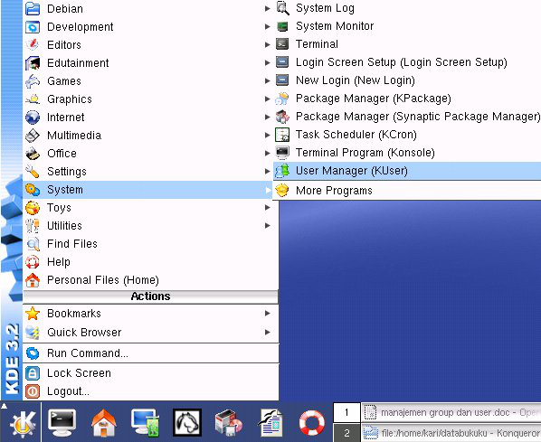
     
     Start menu KDE 3.2 debian GNU/Linux

Selanjutnya sistem akan meminta anda memasukkan password user root.klik [ok]
untuk melanjutkan ke proses berikutnya.

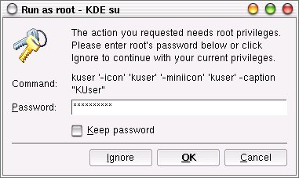
     
     Jendela dialog untuk akses ke user root

Pembuatan group account dapat anda lakukan dengan mengklik group pada
main bar KDE User Manager-KUser seperti yang tampak pada gambar berikut.
Sorot opsi Add... untuk menambah group baru.

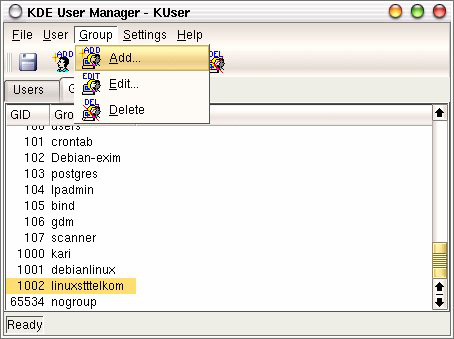
   
    Manajemen group GNU/Linux

Masukkan nama group yang akan anda buat lengkap dengan Group number
(misal: linuxgila, 1003).

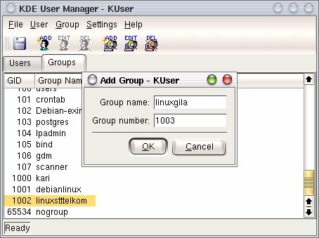
     
     Penambahan group account baru

Mengedit Group Account
----------------------

Fasilitas pengeditan terhadap sebuah group disediakan juga oleh KUser. Pada
menu bar, klik opsi Group → Edit... seperti yang tampak pada gambar berikut
ini.

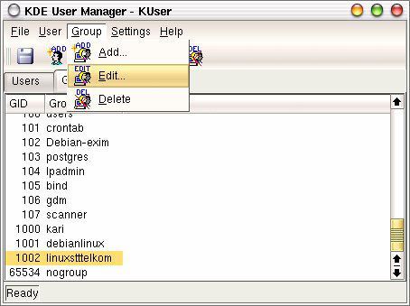
     
     Pengeditan group account

Pilih sejumlah user yang dimasukkan ke dalam sebuah group yang sama.

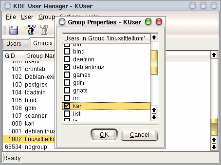
    
    Pemilihan user untuk sebuah group yang sama

Menghapus Group Account
-----------------------

Klik group account yang akan dihapus, kemudian klik opsi Group → Delete.

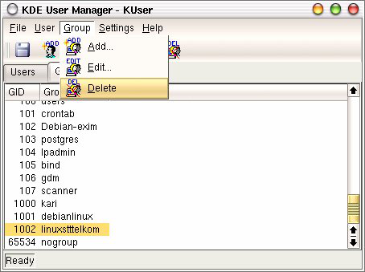
    
    Penghapusan group account

Selanjutnya akan muncul jendela verifikasi yang menanyakan apakah group
account tersebut akan dihapus.

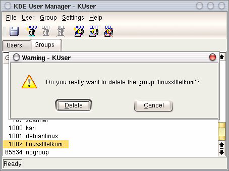

    Jendela verifikasi penghapusan group account

Manajemen User
==============

Manajemen User Account dengan Command Line
------------------------------------------

Penambahan User Account
```````````````````````

Pembuatan user account dapat menggunakan dua perintah yang berbeda, yakni
useradd dan adduser. Berikut penjelasan masing-masing perintah pembuatan
user::

useradd
'''''''

Pembuatan user account dengan useradd memiliki aturan tersendiri tentang
bagaimana menambahkan uid, group, direktori home, dll.::

	debian:~# useradd --help

Misal:
Penulis ingin membuat sebuah user account baru dengan nama debian, dengan
ketentuan sbb:
Memiliki direktori home dengan nama `/home/debian`
Berada pada group `linuxstttelkom`
UID user debian 504
Menggunakan shell `csh`
Menggunakan password `debiangelo`
Solusi:


adduser
'''''''

Penggunaan perintah adduser tidak jauh berbeda dengan perintah useradd.
Untuk melihat opsi-opsi apa saja yang dibutuhkan, gunakan perintah berikut ::

	debian:~# adduser –-help 
	adduser [--home DIR] [--shell SHELL] [--no-create-home] [--uidID]
	[--firstuid ID] [--lastuid ID] [--gecos GECOS] [--ingroup GROUP
	|--gid ID][--disabled-password] [--disabled-login] user

Misal:
Penulis ingin membuat sebuah user account baru dengan nama linuxgila, dengan
ketentuan sbb:

Memiliki direktori home dengan nama `/home/linuxgila`
Berada pada group `linuxstttelkom`
UID user debian 505
Menggunakan shell `bash`
Menggunakan password `linuxgila`
Solusi:


Untuk memastikan apakah user `linuxgila` telah berada di bawah group `linuxstttelkom`,
periksa file konfigurasi group pada direktori /etc/group.::

 debian:~# more /etc/group
 bind:x:105:
 scanner:x:107:
 gdm:x:106:
 debianlinux:x:1001:
 linuxstttelkom:x:1002:debian,debianlinux,linuxgila
 debian:x:505:
 debianlinux:x:506
 linuxgila:x:507:

Menghapus User Account
``````````````````````

Penghapusan user account dapat menggunakan perintah berikut: ::

 debian:~# userdel –r namauser

Misal:
User `linuxgila` akan dihapus pada sistem debian GNU/Linux, maka perintah
yang digunakan adalah: ::

	debian:~# userdel –r linuxgila

atau dapat menggunakan perintah `deluser` seperti contoh berikut: ::

	debian:~# deluser –-help
	deluser: removing user and groups from the system. Version: 3.57
	deluser user
	remove a normal user from the system
	example : deluser mike --remove-home 
	spool
	--remove-all-files
	--home <dir>
	--backup
	--backup-to <dir>
	--system
	remove the users home directory and mail
	remove all files owned by user
	remove home only if /etc/passwd home dir
	matches directory given here
	backup files before removing.
	target directory for the backups.
	Default is the current directory.

Misal:
Penulis ingin menghapus user `debian` pada sistem, maka perintah yang
digunakan adalah: ::

	debian:~# deluser –-remove-home –remove-all-files debian

Menghapus User pada Group
`````````````````````````

Penghapusan user pada group dapat menggunakan perintah berikut:
debian:~# deluser user group
Misal:
Penulis ingin menghapus user `linuxgila` dari group `linuxstttelkom`, maka
perintah digunakan adalah:
debian:~# deluser linux linuxstttelkom

Manajemen User Account dengan GUI
=================================

Menambah User Account
---------------------
Untuk menambah user baru, pada menu bar, klik User → Add...seperti yang
tampak pada gambar berikut.

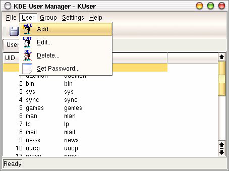
    
    KDE User Manager – KUser
 
Selanjutnya akan muncul jendela dialog berikutnya seperti yang tampak pada
gambar berikut ini.

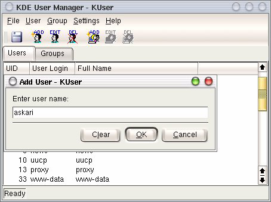
    
    Jendela dialog untuk menambah user account

Mengedit User Account
Pengeditan sebuah user account dapat anda lakukan dengan menyorot user yang
akan diedit, kemudian klik User → Edit...

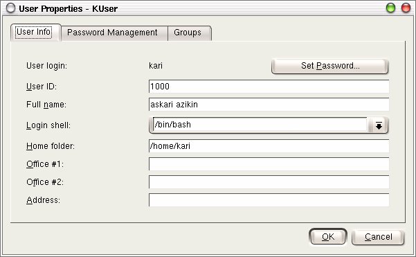
    
    Pengeditan user account

Pada tab Password Management, terdapat informasi tentang perubahan
password terakhir kali. Selain informasi tersebut, anda juga dapat melakukan
perubahan seperti perubahan password tidak dapat dilakukan sebelum jumlah
hari yang telah ditentukan, masa kadaluarsa password, menonaktifkan user
account, dll.

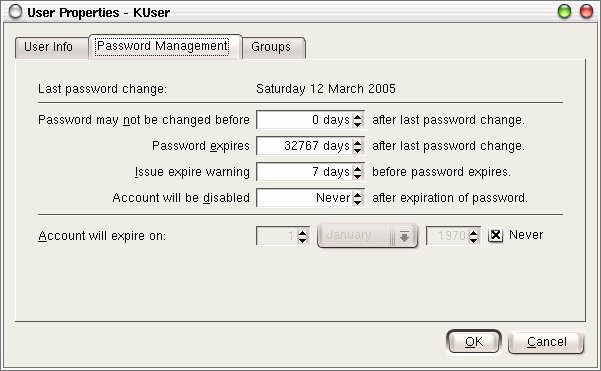
    
    Manajemen password

Pada tab Groups, anda dapat menambahkan user-user yang akan disertakan pada
group yang ada.

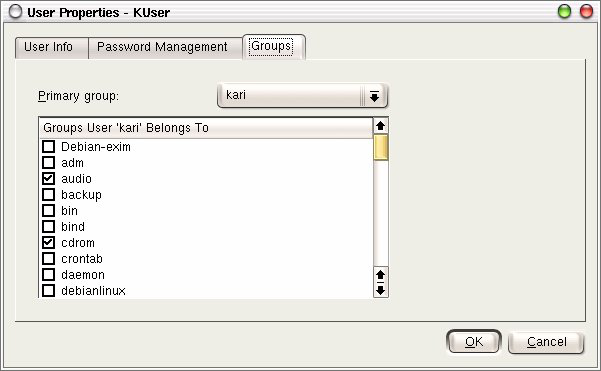
    
    Manajemen group

Mengedit Password
------------------

Password dari user dapat anda ubah pada bagian user info → Set Password
seperti yang tampak pada gambar berikut ini.

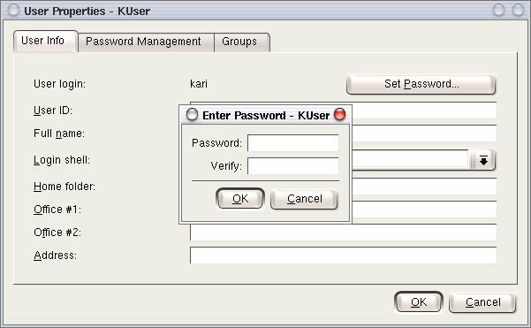
    
    Pengeditan password

Selain menggunakan user info, mengedit password user juga dapat dilakukan
dengan menyorot user account yang bersangkutan, kemudian pada tab User,
klik opsi Set Password...

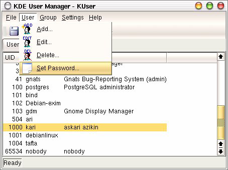
    
    Penyetingan password user

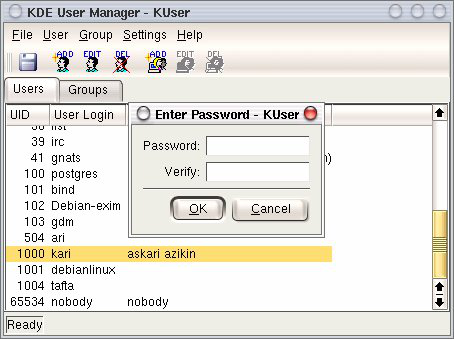
    
    Password user

Menghapus Password
------------------

Penghapusan user account dapat anda lakukan dengan menyorot terlebih dahulu
user yang akan dihapus, kemudian pada tab User, pilih opsi Delete.

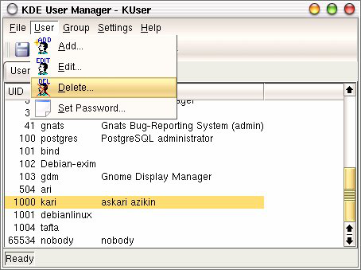
    
    Penghapusan user account

Kemudian akan muncul jendela verifikasi untuk menanyakan apakah user
account tersebut akan dihapus.

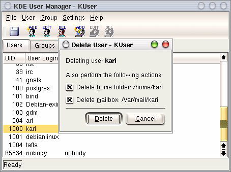
    
    Jendela verifikasi penghapusan user account

Letak Informasi User dan Group Tersimpan
----------------------------------------

Seluruh informasi user dan group terletak pada dua file yang berbeda. Informasi
untuk user account terletak di /etc/passwd dan informasi group terletak di
/etc/group. Keduanya merupakan plain text file, sehingga anda dapat melihatnya
isi dari filenya dengan menggunakan editor teks biasa. ::

	debian:~# more /etc/passwd

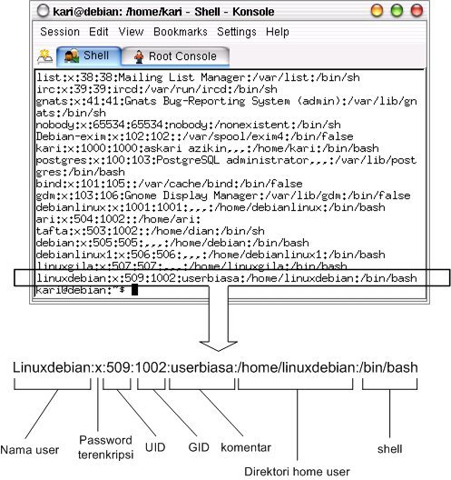
    
    Direktori penyimpanan user account

Keterangan:
Nama user : Nama user yang ada pada sistem
Password terenkripsi : Password user yang telah terenkripsi
UID : User identification
GID : Group identification
Komentar : Berisi informasi tentang user
Direktori home user : Merupakan letak direktori home untuk user
Shell : Shell default yang akan digunakan oleh user

Sedangkan informasi group account dapat dilihat di /etc/group seperti yang
tampak pada gambar berikut. Gunakan perintah berikut untuk mengakses file
konfigurasi group.::

	debian:~# more /etc/group

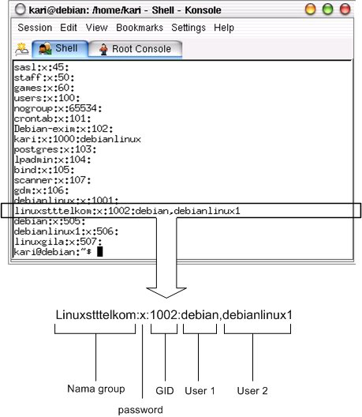

    Direktori penyimpanan group account

Keterangan:
Nama group : Nama group yang ada pada sistem GNU/Linux
Password : Pengggunaan password untuk group jarang digunakan
GID : Group Identification, biasanya berkisar 500 atau lebih
User 1,..user N : User-user yang terdapat dalam satu group yang sama

Modifikasi User Account
-----------------------

Modifikasi user account dapat anda lakukan dengan perintah berikut: ::

	debian:~# usermod –-help
	usage: usermod
	[-u uid [-o]]
	[-d home [-m]]
	[-l new_name]
	[-p passwd]
	[-g group] [-G group,...]
	[-s shell] [-c comment]
	[-f inactive] [-e expire ]
	[-L|-U] name

Misal:
Pada sistem debian GNU/Linux terdapat sebuah user account`linuxdebian`.
Diinginkan direktori home dari user yang bersangkutan diubah menjadi
/home/kariagekun, shell yang digunakan bukan lagi bash tapi csh, UID user juga
diubah menjadi 502, serta nama user menjadi 'debiangila'.
Solusi :


Untuk melihat perubahan yang ada, buka file /etc/passwd sebagai tempat
penyimpanan user account. ::

	debian:~# more /etc/passwd
	debian:x:505:505:,,,:/home/debian:/bin/bash
	debianlinux1:x:506:506:,,,:/home/debianlinux1:/bin/bash
	linuxgila:x:507:507:,,,:/home/linuxgila:/bin/bash
	**debiangila:x:502:1002:userbiasa:/home/kariagekun:/bin/csh**
