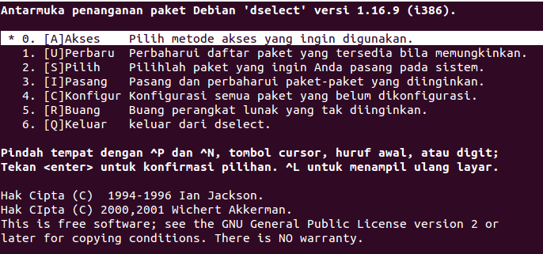

Dselect
=======

Tool instalasi `dselect` ini memberikan kemudahan kepada user debian
GNU/Linux dalam melakukan instalasi karena dilengkapi dengan tampilan semi
grafis. Anda hanya menyorot opsi [I]nstall jika ingin menginstal atau meng-
upgrade paket software, opsi [R]emove jika ingin menghapus sebuah software
dari sistem, opsi [C]onfig untuk mengkonfigurasi paket software yang belum
terkonfigurasi, dan beberapa opsi lain yang diperlukan. Pengaksesan tool
`dselect` dapat menggunakan perintah berikut::

 debian:~# dselect

atau bila menggunakan sudo::

 debian:~$ sudo dselect

Maka akan nampak pada terminal sebagai berikut.

