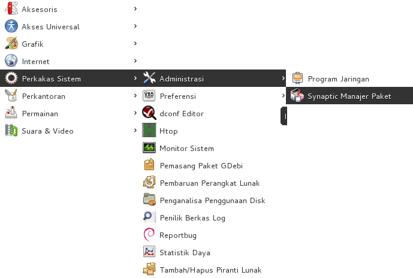

Synaptic - Pemasangan perangkat lunak dengan GUI
================================================

Selain menggunakan apt, dpkg, dselct, kita juga dapat menggunakan antarmuka
grafis dengan synaptic. Untuk mengakses synaptic package manajer dapat dengan
mengetikkan synaptic bila menggunakan gnome-shell atau dengan memilih **Aplikasi>
Perkakas System > Administrasi> Synaptic Package Manajer** bila menggunakan
gnome-clasic.

