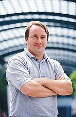

Sistem Operasi
==============

Tugas utama dari sebuah sistem operasi adalah menyediakan interface
(antarmuka) antara aplikasi user dan hardware (perangkat keras) komputer.
Aplikasi user adalah program yang ditulis untuk membantu pengguna dalam
menyelesaikan pekerjaannya seperti program akuntansi, pemrosesan data,
perangkat lunak database, manajemen sistem informasi, dll.

Sebuah sistem operasi bertanggung jawab untuk mengatur sumber daya
perangkat keras, mencegah terjadinya konflik antara program aplikasi yang ada,
dan untuk sistem operasi multiuser bertanggung jawab mencegah terjadinya
konflik diantara komputasi yang dibutuhkan oleh setiap user yang sedang login
ke komputer. Hardisk, port I/O, memori, CPU – seluruh sumber daya perangkat
keras komputer ini membutuhkan pengaturan tentang bagaimana cara
pengaksesan atau pengalamatannya.

Program-program aplikasi berjalan di level tertinggi dari sistem operasi,
sehingga program ini tidak perlu mengetahui seluk beluk perangkat keras
komputer. Selain itu, beberapa sistem operasi didesain untuk keperluan spesifik
seperti aplikasi embedded OS sehingga kustomasi software benar-benar
merupakan faktor terpenting.

GNU Software
============

Proyek pengembangan GNU berdiri pada tahun 1984 oleh Richard Matthew
Stallman yang kesehariannya bekerja sebagai karyawan MIT. Tujuan dari
proyek GNU ini adalah untuk mengembangkan software-software dengan penuh
kebebasan (free software). Free software ini berarti kebebasan bagi setiap orang
untuk melihat source code, kebebasan untuk mempelajari, serta kebebasan
dalam mengembangkannya. Pada tahun 1989 Richard Stallman
mendeklarasikan sebuah lisensi terhadap proyek GNU yang beliau kembangkan
dalam kurung waktu 5 tahun. Richard M. Stallman mendeklarasikan GNU
Public License (GPL). Hak lisensi ini lebih tertuju kepada lisensi copyleft yang
tentu saja sangat berbeda dengan hak lisensi copyright.

Pada tahun 1991 ketika Linus B. Torvalds menciptakan kernel linux yang
dikombinasikan dengan software GNU. Kombinasi antara kernel Linux dan
software GNU ini yang kemudian menjadi cikal bakal dari free operation system
GNU/Linux.

Banyak user atau pengguna OS tersebut menginstal tool-tool GNU pada mesin-
mesin yang berbeda tipe tanpa ada masalah. Tool GNU ini menyediakan
konsistensi terhadap platform PC yang berbeda-beda.

Tool-tool GNU dikembangkan oleh GNU Project meliputi utility yang cukup
esensial seperti manajemen file GNU (The GNU File Management) dan utility
text processing GNU. Manajemen file GNU meliputi perintah-perintah dasar
yang banyak digunakan jika bermain pada lingkungan mode teks (ls, mv, mkdir,
head, sort, wc, cat, less, mtools, tar, textutils, gzip, time,wget, emacs, gcc,
gphoto, binutils, bash, awk, gtk +, aspell, gdb, gnumeric, dll).
Daftar paket software yang dikembangkan oleh GNU Project dapat dilihat di
website `GNU Project`_.

Linux kernel
============

Awalnya Unix merupakan sistem operasi yang sangat populer karena
kemurniannya, dan ketersediaan source code program. Namun akhirnya dengan
berbagai macam alasan, hak lisensi UNIX mulai melarang penggunaan source
code untuk diajarkan di lingkungan universitas.

Linux sendiri adalah sebuah kernel yang dikembangkan oleh Linus B. Torvalds
karena terinspirasi oleh kernel MINIX buatan Andy Tanenbaum. Salah satu hal
penting yang patut untuk dicatat pada Linux adalah pengembangan arsitektur
komponen dasar yang menitipberatkan pada fasilitas sharing resource untuk
aplikasi-aplikasi yang berjalan di atas GNU/Linux. Misalnya Desktop Manager
GNOME, menggunakan Bonobo (Built on top of the international CORBA
standard) untuk sharing resource arsitektur komponen-komponen softwarenya.

GNU/Linux
=========

Sebagaimana yang telah dijelaskan sebelumnya, GNU dan Linux adalah suatu
kesatuan software yang saling terintegrasi membentuk sebuah sistem operasi
yang cukup handal dan stabil. GNU/Linux merupakan sistem operasi
multitasking, dan sekaligus multiuser. Disebut multitasking karena GNU/Linux
dapat mengatur sharing CPU dari tugas-tugas yang sedang dieksekusi. Setiap
tugas (task) mendapatkan sumber daya perangkat keras yang sama. GNU/Linux
harus dapat memroses setiap tugas (task) dalam waktu yang sangat singkat.
Beberapa tugas memiliki prioritas tertinggi sehingga diperlukan juga prioritas
pemakaian sumber daya CPU ke tugas tersebut.

.. figure:: ../images/pendahuluan/tux.png
    :align: center

    Tux sebagai logo Linux

Salah satu keunggulan dari sistem operasi multitasking adalah kemampuan dari
sistem operasi tersebut untuk dapat menjalankan tugas-tugas yang berbeda
secara simultan.

Bagaiamana sebuah komputer dapat dikatakan multiuser?, Cukup sederhana
saja, yakni pengguna dapat menggunakan komputer yang sama pada waktu yang
bersamaan dan tetap terjadi proses pemisahan informasi antara pengguna yang
ada. Sistem operasi multiuser harus mampu mengakomodasikan koneksi lebih
dari satu user ke sistem secara simultan.

Tokoh penting GNU/Linux
-----------------------

Richard Matthew Stallman
~~~~~~~~~~~~~~~~~~~~~~~~

Richard Matthew Stallman (RMS) lahir di Manhattan pada tanggal 16 Maret
1953 dari pasangan Alice Lippman dan Daniel Stallman. Richard Stallman
adalah tokoh sentral Free Software Foundation, pendiri Proyek GNU serta
pencetus hak lisensi copyleft dan konsep ini diabadikannya dengan lisensi
General Public License (GPL).

.. figure:: ../images/pendahuluan/rms.jpeg
    :align: center

    RMS dalam sampul *Free as Freedom*

Proyek GNU yang diciptakan oleh Richard Stallman antara lain: teks editor
Emacs, debugger GDB, kompiler GNU (GCC) yang saat ini telah mendukung
30 macam arsitektur komputer dan 7 macam bahasa pemrograman. Software-
software buatannya merupakan bagian terpenting pada proyek GNU secara
keseluruhan.

Tahun 1960-an merupakan era Personal Computer (PC). Kesempatan pertama
yang didapatkan Stallman untuk mendalami komputer saat ia duduk di bangku
sekolah menengah pertama (junior high school). Stallman menghabiskan masa
liburannya setelah menyelesaikan sekolah menengah pertama untuk menulis
program pertamanya.

Bahasa pemrograman yang digunakan pada waktu itu adalah PL/I pada
komputer IBM 7094. Tahun 1974 Stallman meraih gelar BA pada bidang fisika
di Harvard University. Selama menjalani masa perkuliahannya di Harvard
University, Stallman juga bekerja sebagai staff hacker di laboratorium AI MIT.
Tahun 1984 Stallman mengundurkan diri dari MIT untuk mencurahkan
perhatian sepenuhnya terhadap proyek GNU sehingga akhirnya tidak dapat
menyelesaikan program doktoral yang diikutinya. Namun demikian, Stallman
telah mendapat 3 gelar Doctor Honoris Causa (HC) dari beberapa universitas di
dunia.

Selain itu, Stallman juga sempat menjabat sebagai Asisten Laboratorium
Biologi di Universitas Rockefeller. Berkat kemampuan analisis yang sangat
tinggi sehingga membuat kagum pimpinan Laboratorium tersebut. Hal lain yang
membuat pimpinan lab terkagum-kagum pada diri seorang Stallman karena latar
belakang pendidikannya selama ini bukan dalam bidang biologi melainkan
matematika dan fisika. Kemampuan lain yang dimiliki seorang Stallman adalah
dalam bidang komputer.

Beberapa penghargaan yang diperoleh Richard Matthew Stallman:
 - MacArthur Fellowship - tahun 1990
 - The Association for Computing Machinery’s Grace Hopper Award atas
   software emacs buatannya - tahun 1991
 - Doctor Honoris causa (HC) dari Sweden’s Royal Institute of Technology -
   tahun 1996
 - Electronic Frontier Foundation’s Pioneer Award - tahun 1998
 - Yuri Rubinski Memorial Award - tahun 1999
 - Doctor Honoris causa (HC) dari Universitas Glasgow - tahun 2001
 - The Takeda Techno-Entreprenourship Award - tahun 2001
 - National Academy of Engineering membership - tahun 2002
 - Doctor Honoris causa (HC) dari Vrije Universiteit Brussel - tahun 2003

Linus B. Torvalds
~~~~~~~~~~~~~~~~~

Linus Torvalds lahir pada tanggal 28 Desember 1969 di Helsinki-Finland.
Ayahnya bernama Torvalds. Saat berusia 10 tahun Linus Torvalds sudah mulai
mencoba membuat program pada komputer Commodore VIC-20 milik sang
kakek.

    Linus Trovalds

Tahun 1991 Torvalds tercatat sebagai mahasiswa ilmu komputer di University
of Helsinki, Finland. Di tahun yang sama Torvalds membeli sebuah komputer
(PC) dengan MS-DOS sebagai sistem operasinya. Namun Linus Torvalds
sendiri lebih menyukai menggunakan operation system (OS) UNIX yang
digunakan di departemen ilmu komputer tempat ia menuntut ilmu.

Linus Torvalds kemudian membuat base OS (Linux - red) varian UNIX untuk
digunakan pada komputer miliknya. Setelah linux (Linus’s MINIX) rampung,
Linus Torvalds kemudian mengirim email ke internet untuk memberikan
informasi bahwa telah tersedia sebuah sistem operasi gratis beserta source
codenya.

Berkat kestabilan Linux yang jarang mengalami crash membuat para vendor
perusahaan ternama mengumumkan rencananya untuk mendukung linux sebagai
sistem operasi alternative MS-Windows.

Beberapa penghargaan yang diperoleh Linus Torvalds:
 - Nokia Foundation Award - tahun 1997
 - Lifetime Achievement Award at Uniforum Pictures - tahun 1997

Distribusi GNU/Linux
--------------------

Bingung? pertanyaan ini sering muncul bagi para pemula yang ingin
menggunakan sistem operasi (OS) GNU/Linux. Begitulah sedikit gambaran
tentang anggapan orang-orang karena banyak distribusi/distro Linux. Mengapa
sampai banyak varian Linux yang ada saat ini?, hal ini disebabkan karena
sifatnya yang free software-open source alias kebebasan dan kode programnya
terbuka untuk publik sehingga memungkinkan orang untuk membuat distribusi
masing-masing.

Pengertian Free Software dan Open Source Software
=================================================

Mungkin bagi kalangan linuxer tidak asing lagi dengan istilah free software dan
open source software. Pada bagian ini penulis hanya akan menjelaskan sedikit
tentang perbedaan antara free software dan open source software. Pengertian
open source adalah sebuah software dimana kode sumbernya terbuka untuk
publik sehingga semua orang dapat melihat, memodifikasi ulang. Sedangkan
free software tidak dapat diartikan sebagai freeware (gratis dalam penggunaan
produk software). Free software diartikan sebagai sebuah kebebasan dalam
menyalin, mendistribusikan, dan memodifikasi kode sumber tanpa adanya
batasan dari siapa pun juga.

.. Note::
	``Free`` disini bukan berarti hanya gratis, namun juga diartikan bebas
	
Aspek lain dari sebuah aplikasi open source adalah pengembangan dari
perangkat lunak tersebut lebih cepat dan lebih murah dalam segi pendanaannya
karena lebih banyak orang yang terlibat. Aplikasi open source memberikan
beban kerja yang tidak terlampau berat kepada para programmer disebabkan
adanya sharing tugas kepada setiap orang dalam jumlah yang banyak. Aplikasi-
aplikasi software yang mereka hasilkan juga tidak dapat dipandang sebelah mata
sebab kebanyakan hasil karya mereka benar-benar berkualitas tinggi akibat
dukungan orang-orang dengan level kemampuan yang berbeda-beda yang
bersatu dalam satu tim pengembang.

Selain itu, bug-bug aplikasi software open source biasanya lebih cepat diketahui
dibanding aplikasi close source dan penanganannya pun akan lebih cepat pula.

Free Documentation
------------------

Pada bulan maret 2000, Richard M. Stallman bersama Eben Moglen – seorang
professor dari Columbia Law School mengumumkan hak kepemilikan
dokumentasi yang berlisensi “GNU Free Documentation License (GFDL)”.
Sebuah dokumen GFDL haruslah bersifat transparan – dalam arti kata bahwa
dokumen tersebut harus tersedia dalam format yang dapat dibaca dengan
menggunakan free software seperti latex atau yang mendukung format XML.

.. _GNU Project: http://www.gnu.org/software/software.html
.. [#] http://en.wikipedia.org/wiki/File:Tux.svg
.. [#] http://en.wikipedia.org/wiki/File:Richard_Matthew_Stallman.jpeg
.. [#] http://en.wikipedia.org/wiki/File:Linus_Torvalds.jpeg
