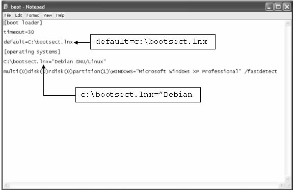
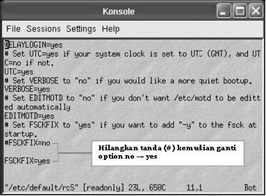
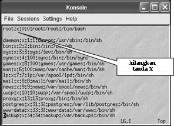
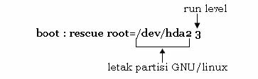
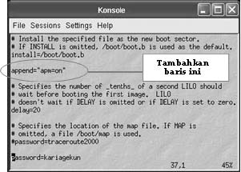

Boot Disk 
=========

Pada windows 98, terkadang membutuhkan boot disk untuk boot sistem pertama kali dari floppy drive. Pada GNU/Linux, terkadang kita juga membutuhkan boot disk jika sewaktu-waktu komputer kita mengalami masalah untuk booting ke sistem. 

Langkah-langkah dalam membuat boot disk pada Debian GNU/Linux: 

Masukkan disket anda ke dalam floppy drive, kemudian ketikkan perintah berikut::

   ~# mke2fs /dev/fd0 
   ~# mount –t ext2 /dev/fd0 /floppy 
   ~# cd /floppy 
   /floppy# mkdir etc && mkdir boot 
   /floppy# cp –R /boot /floppy/boot 

Buat file konfigurasi ``lilo.conf`` di direktori ``/floppy/etc/``

::

   /floppy# cd etc/ 
   /floppy/etc# cat > lilo.conf 
   
Kemudian tambahkan baris berikut:

::

   boot=/dev/fd0
   install=/boot/boot.0300 
   map=/boot/map 
   read-only    
   image=/boot/vmlinuz-2.4.25-1-386     
   label=DebianSarge
   root=/dev/hda7 
   
Menginstal lilo boot loader ke floppy drive

::

   /floppy/etc# cd ../ 
   /floppy# lilo –C etc/lilo.conf 
   
Reboot sistem debian sarge dari floppy drive::

   ~# reboot 

   
Dual Boot: MS-Windows XP/2000 dan GNU/Linux 
-------------------------------------------

Selain menggunakan boot loader bawaan default linux (LILO atau GRUB), dapat juga menggunakan bootloader MS-Windows. Berikut langkah-langkah dalam melakukan setting boot loader MS-Windows agar dapat booting linux, Pada konsole linux, ketikkan perintah berikut:

::

   ~$ su – 
   password: 
   ~# dd if=/dev/hda7 of=bootsect.lnx bs=512 count=1 
   ~# mount /dev/sda1 /mnt 
   ~# cp bootsect.lnx /mnt 
   ~# lilo –u /dev/hda7 
   ~# reboot 
   
.. Note::
   /dev/hda7 merupakan tempat anda menyimpan lilo bootloader saat instalasi debian. 
   
Masuk ke OS MS-Windows XP/2000, kemudian pada command prompt ketikkan perintah berikut:

::

   c:> copy f:\bootsect.lnx c:\bootsect.lnx 
   c:> notepad c:\boot.ini 

.. Note::
   Selain menggunakan prompt DOS, penyalinan file juga dapat dilakukan dengan cara biasa yakni menggunakan windows explorer. Kemudian tambahkan baris berikut::
   
      default=c:\bootsect.lnx 
      c:\bootsect.lnx=”Debian GNU/Linux” 

   *File konfigurasi boot.ini MS-Windows XP*

*Sumber:Debian GNU/Linux Desktop Survival Guide – Graham Williams*

Mencegah Prompt fsck saat Booting 
---------------------------------

Untuk mencegah prompt fsck saat booting, tambahkan ``FSCKFIX=yes`` pada file konfigurasi ``/etc/default/rcS``.::

   ~# vi /etc/default/rcS 

   *File konfigurasi /etc/default/rcS*

Lupa Password 
-------------

Cara pertama dapat anda gunakan jika anda tidak menambahkan password untuk lilo boot loader. Pada boot prompt, ketikkan perintah::

   boot: linux init=/bin/sh 
   
Perintah di atas akan menyebabkan sistem melakukan booting ke kernel linux (default) dan menjalankan /bin/sh termasuk init standard. Sekarang anda telah mendapatkan hak akses sebagai root. 

Langkah berikutnya adalah mounting file system root (/). Perintah yang digunakan adalah::

   # mount –n –t remount,rw /
   # mount –avt nonfs, nonproc, nosmbfs 
   # cd /etc
   # vi passwd 

   *File konfigurasi /etc/passwd*

Cara yang kedua adalah dengan menggunakan boot disk. Set BIOS anda agar first boot-nya berada pada floppy disk. Mekanisme ini digunakan jika anda menambahkan password pada lilo boot loader. 
Buat sebuah direktori baru dengan nama linuxdebian::

   # mkdir linuxdebian 
   
Mount partisi linux anda kemudian mapping/petakan partisi tersebut ke direktori yang telah anda buat sebelumnya::

   # mount /dev/hda2 linuxdebian 
   
Pindah ke direktori ``linuxdebian/etc``::

   # cd linuxdebian/etc/ 
   # vi passwd 
   
Hilangkan tanda ``X`` pada baris yang memuat login root seperti pada cara yang pertama. 

Sistem Gagal Booting 
--------------------

Jika sistem anda tidak dapat booting karena lilo boot loader anda rusak, booting dengan boot disk kemudian pad boot prompt, ketikkan perintah berikut: 

PC tidak dapat melakukan "shutdown" atau "poweroff"
---------------------------------------------------

Jika PC anda tidak dapat melakukan shutdown/poweroff, periksa hal-hal berikut: 
   - Periksa apakah motheboard anda telah mendukung APM. 
   - Periksa apakah kernel anda telah dikompilasi dengan mengikutkan sistem yang support APM dan mode flagnya telah diaktifkan. 
   - Untuk kernel 2.2.x tambahkan append=“apm=on” pada file konfigurasi /etc/lilo.conf. 

   *File konfigurasi /etc/lilo.conf*

   - Untuk kernel 2.4.x, ketikkan perintah pada konsole::
   
      ~# insmod apm power_off=1 

      
Menambahkan File Executable agar dapat Dieksekusi saat Booting 
--------------------------------------------------------------

Simpan file tersebut di direktori /etc/init.d/ kemudian berikan hak executable pada file yang bersangkutan, kemudian jalankan perintah “update-rc.d” dengan argumen-argumen yang tepat untuk membuat link dari berbagai macam run level. 

Menambahkan/mengurangi Servis yang Berjalan saat Sistem Start-up 
----------------------------------------------------------------
Gunakan perintah “rcconf” kemudian pilihlah service-service yang akan ditambahkan atau dihilangkan saat sistem booting. 

Mematikan Fungsi ‘CTRL + ALT + DEL’ untuk Shutdown/Reboot 
---------------------------------------------------------
Untuk mematikan fungsi ctrl+alt+del pada sistem, beri tanda (#) di awal baris berikut pada file konfigurasi ``/etc/inittab``.

::

   # ca::ctrlaltdel :/sbin/shutdown –t3 –r now 

