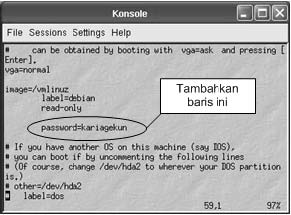
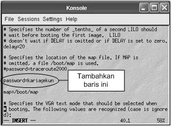
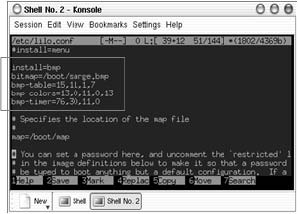
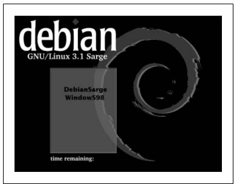

Lilo Boot Loader 
================

Setiap distribusi GNU/Linux pasti memiliki boot loader baik itu Lilo
ataupun Grub. Boot loader ini berfungsi untuk menampilkan option operation
system (OS) yang akan digunakan saat anda menjalankan sistem. Lilo dapat
diinstall ke dalam master boot record (MBR) atau pada partisi hardisk yang
lain.

Password Booting GNU/Linux 
--------------------------

Untuk menambahkan password saat booting GNU/Linux, tambahkan baris berikut
pada file konfigurasi /etc/lilo.conf  tepat di bawah baris read-only.

::

   image=/vmlinuz
          label=debian
          read-only
          password=password-anda

Gunakan text editor seperti vi untuk mengedit file konfigurasi tersebut::

   ~# vi /etc/lilo.conf

   *Setting password GNU/linux*

Password Seluruh OS pada Lilo Boot Loader
-----------------------------------------

Untuk menambahkan password yang sama pada setiap sistem operasi, ubah
posisi ``password=password-anda`` sesuai yang tertera seperti gambar
berikut ini.

   *Setting password GNU/Linux dan OS lain*

Setelah anda melakukan konfigurasi lilo boot loader, ubahlah hak akses file
tersebut sehingga yang dapat mengaksesnya hanyalah user root saja. Gunakan
perintah berikut::

   ~# chmod 600 /etc/lilo.conf

Kemudian gunakan perintah chattr untuk merubah atribut file. Perintah yang
digunakan adalah::

   ~# chattr +i /etc/lilo.conf
   
Untuk melakukan modifikasi atau perubahan kembali pada file tersebut,
gunakan perintah::

   ~# chattr -i /etc/lilo.conf

Splash pada Boot Loader LILO
----------------------------

Tampilan default dari lilo boat loader biasanya dalam mode text (merah,
putih, hitam). Agar tampilan lilo boat loader lebih menarik, anda dapat 
menggunakan mode grafik yang dapat dibuat sesuai dengan kesukaan masing
masing orang.

Langkah pertama yang anda lakukan adalah membuat file gambar (.bmp) dengan
ukuran gambar 640x480.

Pada konsole, ketikkan perintah berikut untuk mengedit file konfigurasi
``/etc/lilo.conf``::

   ~# mcedit –c /etc/lilo.conf
   
Kemudian tambahkan baris berikut:

::

   install=bmp
   bitmap=/boot/sarge.bmp 
   bmp-table=15,11,1,7
   bmp-colors=13,0,11,0,13
   bmp-timer=76,30,11,0

   *File konfigurasi /etc/lilo.conf*

Simpan perubahan file konfigurasi yang telah anda lakukan, kemudian
ketikkan kedua perintah berikut untuk melihat perubahan yang ada.::

   ~# lilo
   ~# reboot

Berikut tampilan lilo boot loader dengan splash image yang penulis gunakan.

   *Tampilan lilo boot loader*

Menghapus Lilo pada MBR (Master Boot Record)
--------------------------------------------

GNU/Linux::

   ~# lilo –u /dev/hda
   
Pada DOS dan Windows 9x/ME::

   C:> fdisk /mbr
   
Pada windowsXP:

Masukkan cd installer windowsXP, kemudian pilih opsi repair windows XP
dengan menekan ``R``. Kemudian akan dihadapkan mode prompt DOS dan ketikkan
perintah berikut::

   C:windows> fixmbr
