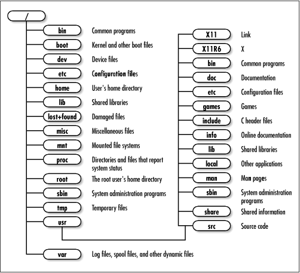
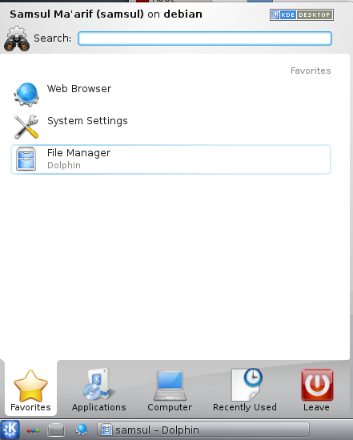
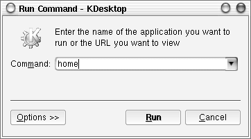
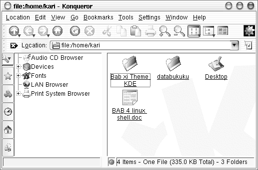
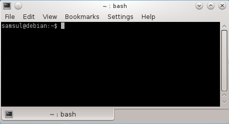
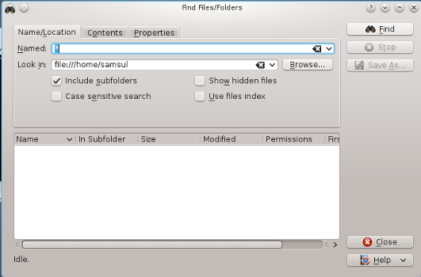

Memahami direktori GNU/Linux
----------------------------

Direktori debian GNU/Linux tersusun secara hirarki. Berbeda dengan microsoft
windows yang mengelompokkan berdasarkan partisi yang ada. Debian
GNU/Linux hanya memiliki satu hirarki direktori besar yang berisi semua
partisi yang ada. Direktori teratas adalah direktori root yang ditandai dengan
forward slash (/).

Di bawah direktori root (/) berisi sub direktori */bin, /boot, /dev, /etc, /home, /lib,
/lost+found, /misc, /mnt, /proc, /root, /sbin, /tmp, /usr, /var*. Di bawah
subdirektori yang telah disebutkan di atas, masih terdapat subdirektori lagi
hingga berupa file saja.

Meskipun bukan sesuatu yang begitu penting untuk mengetahui isi seluruh
direktori debian GNU/Linux, tapi merupakan hal yang sangat baik jika anda
mengetahui jenis-jenis dari file yang tersimpan pada setiap direktori yang ada.

Direktori Debian GNU/Linux
~~~~~~~~~~~~~~~~~~~~~~~~~~

Struktur debian GNU/Linux dan varian GNU/Linux lain berdasarkan pada
sistem operasi UNIX. Keuntungan dari sistem direktori ini adalah anda dapat
memposisikan sebuah partisi sebagai sebuah file pada sistem. Berikut ini
struktur direktori/file debian GNU/Linux:

+-----------------+----------------------------------------------------------------------+
| **/**	          | Direktori *root*. Berisi seluruh file dan direktori lain.            |
+-----------------+----------------------------------------------------------------------+
| **/bin**	  | File biner atau file executable yang dapat digunakan baik user biasa |
|		  | ataupun user root.                                                   |
+-----------------+----------------------------------------------------------------------+
| **/boot**	  | File-file yang dibutuhkan sistem saat booting, termasuk kernel.      |
+-----------------+----------------------------------------------------------------------+
| **/cdrom**	  | Mounting point untuk cdrom. Jika sistem memilki 2 buah cdrom drive   |
|		  | maka akan dikenali sebagai /cdrom2.                                  |
+-----------------+----------------------------------------------------------------------+
| **/floppy**	  | Mounting point untuk floppy drive. Jika sistem memiliki 2 buah       |
|		  | floppy drive maka akan dikenali sebagai /floppy2.                    |
+-----------------+----------------------------------------------------------------------+
| **/dev**	  | Mendefinisikan perangkat keras hardisk, partisi, dan perangkat keras |
|		  | lainnya. Direktori /dev juga berisi tool makedev untuk membuat       |
|		  | device baru.                                                         |
+-----------------+----------------------------------------------------------------------+
| **/etc** 	  | File konfigurasi sistem debian GNU/Linux seperti /etc/X11 untuk      |
|		  | konfigurasi X Window.                                                |
+-----------------+----------------------------------------------------------------------+
| **/home** 	  | Direktori home untuk user biasa. Sedangkan direktori home untuk user |
|		  | root adalah /root.                                                   |
+-----------------+----------------------------------------------------------------------+
| **/initrd**	  | File-file untuk RAM Disk GNU/Linux.                                  |
+-----------------+----------------------------------------------------------------------+
| **/lib**	  | Pustaka program yang dibutuhkan untuk menjalankan sistem dan         |
|		  | perintah dasar.                                                      |
+-----------------+----------------------------------------------------------------------+
| **/lost+found** | File-file recovery                                                   |
+-----------------+----------------------------------------------------------------------+
| **/mnt**	  | Sebuah folder tempat mount point device.                             |
+-----------------+----------------------------------------------------------------------+
| **/proc**	  | Proses dan informasi sistem.                                         |
+-----------------+----------------------------------------------------------------------+
| **/sbin**	  | File-file executable yang dibutuhkan untuk boot sistem serta program-|
|		  | program *maintenance* seperti lilo, ifconfig, mkfs, dll dan hanya    |
|		  | dapat dieksekusi oleh user root.                                     |
+-----------------+----------------------------------------------------------------------+
| **/usr**	  | Merupakan direktori tempat aplikasi disimpan oleh GNU/linux, saat    |
|		  | anda menginstal sebuah program di debian GNU/linux maka akan         |
|		  | secara otomatis disimpan di direktori tersebut.                      |
+-----------------+----------------------------------------------------------------------+
| **/var**	  | File data yang berisi tentang perubahan-perubahan yang dilakukan     |
|		  | seperti cache, spool, log file, dan file mailbox user.               |
+-----------------+----------------------------------------------------------------------+
|**/var/lock**	  | File lock untuk menjaga user lain menggunakan file tersebut.         |
+-----------------+----------------------------------------------------------------------+
|**/var/log**	  | Berisi log dari sebuah program                                       |
+-----------------+----------------------------------------------------------------------+
|**/tmp** 	  | Direktori ini digunakan untuk penyimpanan sementara	                 |
+-----------------+----------------------------------------------------------------------+

Direktori-direktori di atas adalah direktori induk yang dibawahnya masih
terdapat sub direktori, antara lain:

==============	================================================================
**/usr/X11R6** 	Berisi file-file yang dibutuhkan oleh sistem X Window.
**/usr/bin** 	Berisi file-file biner/program yang dapat digunakan oleh seluruh user.
**/usr/doc** 	Berisi dokumentasi yang dapat diakses oleh seluruh user.
**/usr/games** 	Berisi program game yang dapat diakses oleh seluruh user.
**/usr/lib** 	Berisi file biner untuk bahasa pemrograman yang dapat diakses oleh
		seluruh user.
**/usr/local** 	Berisi program yang ditulis oleh user pada komputer lokal.
**/usr/src** 	Berisi source code untuk sistem operasi GNU/Linux seperti kernel
		Linux, dll.
==============	================================================================

Direktori Home
~~~~~~~~~~~~~~

Saat menjalankan Debian GNU/linux, anda akan dihadapatkan dengan direktori
home sebagai direktori default buat user. Setiap user memiliki direktori home
sendiri tempat penyimpanan default file-file yang telah anda buat. Setiap home
user kecuali superuser (root) adalah subdirektori dan berada di bawah direktori
/home. Hal ini sangat penting karena file-file yang anda buat tidak dapat
disimpan kesembarang direktori pada debian GNU/Linux. Akses ke banyak
direktori akan dibatasi oleh sistem kecuali jika login sebagai user root. Oleh
karena itu, direktori home ini merupakan tempat penyimpanan file secara default
oleh user.

Penelusuran File dan Direktori dengan File Manager
~~~~~~~~~~~~~~~~~~~~~~~~~~~~~~~~~~~~~~~~~~~~~~~~~~

Saat anda membuka file manager Debian GNU/Linux, maka secara default akan
dihadapkan dengan direktori */home/$user*. Pada start menu, klik Personal Files
(home) selanjutnya akan muncul file manager seperti yang tampak pada gambar
berikut.

Atau dengan menekan Alt+F2 pada keyboard kemudian ketikkan home pada
jendela dialog yang telah tersedia seperti pada gambar berikut.

Selanjutnya akan muncul window *home/$user* seperti yang tampak pada gambar
berikut.

Hal ini juga berlaku jika anda membuka konsole GNU/Linux. Direktori yang
pertama kali diakses adalah direktori *home/$user* seperti yang tampak pada
jendela konsole berikut.

Menggunakan Perintah Find pada Desktop KDE
~~~~~~~~~~~~~~~~~~~~~~~~~~~~~~~~~~~~~~~~~~

Pada Start Menu → Kfind. Untuk mencari file cukup dengan mengetikkan nama
file yang anda cari di kolom [Named:], kemudian ubalah letak direktori tempat
file tersebut berada dan klik option [Find] pada bagian kanan atas dari jendela
Kfind.

Menampilkan File dari Command Line
~~~~~~~~~~~~~~~~~~~~~~~~~~~~~~~~~~

GNU/Linux memiliki banyak tool aplikasi untuk menampilkan file dari konsole.
Beberapa tool yang dapat digunakan antara lain : cat, less, tac. Berikut
penjelasan dari setiap command line.

**cat**

Perintah \`cat` sering digunakan untuk menampilkan file-file yang panjang
textnya tidak lebih dari satu layar konsole.

::

	kari@debian:~$ cat [option] FILE

Opsi-opsi yang dimiliki oleh perintah \`cat` antara lain::

--show-ends | -E		Menampilkan akhir kalimat (ditandai dengan $)
--number-nonblank | –b		Menampilkan baris keberapa kalimat tersebut
--show-tabs | –T		Menampilkan tab pada kalimat (ditandai ^I)
--show-nonprinting | –v		Menampilkan karakter non-printing

Misal::

	kari@debian:~$ cat –b /home/kari/XIconWithShadow.h

Keluaran perintah di atas adalah::

	1 /*
	2  * vim:tabstop=4:expandtab:shiftwidth=4
	3  * 
	4  * Idesk -- XIconWithShadow.h 
	5  * 
	6  * Copyright (c) 2002, Chris (nikon) (nikon@sc.rr.com)
	7  * All rights reserved.
	8  * Redistribution and use in source and binary forms, with or
	9  * modification, are permitted provided that the following

**less – Scrool Layar**

Perintah less ini digunakan untuk file-file yang melebihi satu layar konsole.
Perintah less akan menyediakan fasilitas scroll untuk melihat isi file pada baris
berikut yang belum terlihat pada layar konsole sebelumnya.

::
	
	kari@debian:~$ less [option] FILE

Beberapa opsi yang mengikuti perintah less::

-p <string_yang anda ingin tampilkan> 	Menampilkan file yang dimulai dengan string yang anda ingin tampilan.
-y <jumlahbaris> 			Menampilkan isi file per jumlah baris yang anda set.  

Misal::

	kari@debian:~$ less –p include XIconWithShadow.h

Keluaran perintah di atas adalah::

	#**include** "XIcon.h"
	#**include** "XShadowImage.h"
	
	class XIconWithShadow : public XIcon
	{
		protected:
			XShadowImage * shadowImage;
			bool shadowVisible;

**tac – Menampilkan Isi File dari Baris Akhir**

Perintah tac digunakan untuk menampilkan sebuah isi file yang dimulai dari
baris terakhir.

::

	kari@debian:~$ tac FILE

Misal::

	kari@debian:~$ tac XIconWithShadow.h

Keluaran perintah di atas adalah::

	#endif
	};
		void lowerIcon();
		void snapShadow();
		void renderShadowToImage(Pixmap &buffer, int fX, int fY);
		void findSnapPosition(int &xCord, int &yCord);
		virtual int getShadowY() { return shadowY; }
		virtual int getShadowX() { return shadowX; }
		
		virtual ~XIconWithShadow();
			AbstractIconConfig * iConfig);
		XIconWithShadow(AbstractContainer * cont, AbstractConfig
	* con,
	    public:

**Menampilkan File 'postScript'**

Untuk menampilkan sebuah file dalam format PostScript, tool yang dapat
digunakan adalah \`ghostview`.

Misal::

	kari@debian:~$ ghostview /usr/share/doc/example/example.ps

Untuk keluar dari *ghostview* tekan [**Q**] dan [**SPC**] untuk ke halaman berikutnya.

**Menampilkan File 'PDF'**

Untuk menampilkan file dalam format \`pdf` dapat menggunakan perintah
berikut::

	kari@debian:~$ xpdf /usr/share/doc/contoh.pdf

**wc – Analisis Teks**

Fasilitas shell ini dapat digunakan untuk analisis teks seperti menghitung jumlah
kata yang terdapat dalam sebuah teks, menghitung jumlah baris, dll.

::

	kari@debian:~$ wc –-help

	Usage: wc [OPTION]... [FILE]...
	  or:  wc [OPTION]... --files0-from=F
	Print newline, word, and byte counts for each FILE, and a total line if
	more than one FILE is specified.  With no FILE, or when FILE is -,
	read standard input.  A word is a non-zero-length sequence of characters
	delimited by white space.
	The options below may be used to select which counts are printed, always in
	the following order: newline, word, character, byte, maximum line length.
	  -c, --bytes            print the byte counts
	  -m, --chars            print the character counts
	  -l, --lines            print the newline counts
	      --files0-from=F    read input from the files specified by
		                   NUL-terminated names in file F;
		                   If F is - then read names from standard input
	  -L, --max-line-length  print the length of the longest line
	  -w, --words            print the word counts
	      --help     display this help and exit
	      --version  output version information and exit

	Report wc bugs to bug-coreutils@gnu.org
	GNU coreutils home page: <http://www.gnu.org/software/coreutils/>
	General help using GNU software: <http://www.gnu.org/gethelp/>
	For complete documentation, run: info coreutils 'wc invocation'

**Menghitung Jumlah Kata pada Sebuah Teks**

Berikut perintah yang dapat digunakan untuk menghitung jumlah kata pada
sebuah teks.

::

	kari@debian:~$ wc –w bertanya\yang\baik.txt
	
	1626 bertanya yang baik.txt

Dengan tool *wc* ini anda juga dapat menghitung jumlah kata yang terdapat pada
beberapa file sekaligus.

::

	kari@debian:~$ cat *.txt | wc –w
	8879

**Menghitung Jumlah Karakter pada Sebuah Teks**

Jumlah karakter pada sebuah teks dapat dihitung dengan menggunakan perintah
berikut.

::

	kari@debian:~$ wc –m bertanya\yang\baik.txt
	11958 bertanya yang baik.txt

**Menghitung Jumlah Baris pada Sebuah Teks**

Selain menghitung jumlah kata dan karakter, ``wc`` juga dapat digunakan untuk
menghitung jumlah baris pada sebuah teks. Berikut perintah yang digunakan.

::

	kari@debian:~$ wc –l bertanya\yang\baik.txt
	173 bertanya yang baik.txt

**Split File**

Tool ini merupakan karya Richard M. Stallman dan Torbjorn Granlund yang
dapat digunakan untuk membagi sebuah file berukuran besar ke dalam file-file
kecil.

::

	kari@debian:~$ split –-help

	Usage: split [OPTION]... [INPUT [PREFIX]]
	Output fixed-size pieces of INPUT to PREFIXaa, PREFIXab, ...; default
	size is 1000 lines, and default PREFIX is `x'.  With no INPUT, or when INPUT
	is -, read standard input.

	Mandatory arguments to long options are mandatory for short options too.
	  -a, --suffix-length=N   use suffixes of length N (default 2)
	  -b, --bytes=SIZE        put SIZE bytes per output file
	  -C, --line-bytes=SIZE   put at most SIZE bytes of lines per output file
	  -d, --numeric-suffixes  use numeric suffixes instead of alphabetic
	  -e, --elide-empty-files  do not generate empty output files with `-n'
	      --filter=COMMAND    write to shell COMMAND; file name is $FILE
	  -l, --lines=NUMBER      put NUMBER lines per output file
	  -n, --number=CHUNKS     generate CHUNKS output files.  See below
	  -u, --unbuffered        immediately copy input to output with `-n r/...'
	      --verbose           print a diagnostic just before each
		                    output file is opened
	      --help     display this help and exit
	      --version  output version information and exit

	SIZE may be (or may be an integer optionally followed by) one of following:
	KB 1000, K 1024, MB 1000*1000, M 1024*1024, and so on for G, T, P, E, Z, Y.

	CHUNKS may be:
	N       split into N files based on size of input
	K/N     output Kth of N to stdout
	l/N     split into N files without splitting lines
	l/K/N   output Kth of N to stdout without splitting lines
	r/N     like `l' but use round robin distribution
	r/K/N   likewise but only output Kth of N to stdout

	Report split bugs to bug-coreutils@gnu.org
	GNU coreutils home page: <http://www.gnu.org/software/coreutils/>
	General help using GNU software: <http://www.gnu.org/gethelp/>
	For complete documentation, run: info coreutils 'split invocation'

Misal::

	kari@debian:~$ split –bytes=10k bertanya\yang\baik.txt tanya.txt

Perintah di atas akan menghasilkan dua buah file \`tanya.txt.**aa**` dan
\`tanya.txt.**ab**` dengan ukuran file masing-masing 10 k dan 6 k. (gunakan
perintah \`du -k nama_file` untuk melihat kapasitas masing-masing file).

Untuk menyatukan file yang telah displit tadi, gunakan perintah berikut::

	kari@debian:~$ cat tanya.txt.* > tanya3.txt
	kari@debian:~$ rm –rf tanya.txt.*
	kari@debian:~$ more tanya3.txt

**Membandingkan Dua Buah File**

Software ini merupakan buatan Torbjorn Granlund dan David MacKenzie yang
dapat digunakan untuk membandingkan dua buah file.

::

	kari@debian:~$ cmp –-help

	Usage: cmp [OPTION]... FILE1 [FILE2 [SKIP1 [SKIP2]]]
	Compare two files byte by byte.

	The optional SKIP1 and SKIP2 specify the number of bytes to skip
	at the beginning of each file (zero by default).

	Mandatory arguments to long options are mandatory for short options too.
	  -b, --print-bytes          print differing bytes
	  -i, --ignore-initial=SKIP         skip first SKIP bytes of both inputs
	  -i, --ignore-initial=SKIP1:SKIP2  skip first SKIP1 bytes of FILE1 and
		                              first SKIP2 bytes of FILE2
	  -l, --verbose              output byte numbers and differing byte values
	  -n, --bytes=LIMIT          compare at most LIMIT bytes
	  -s, --quiet, --silent      suppress all normal output
	      --help                 display this help and exit
	  -v, --version              output version information and exit

	SKIP values may be followed by the following multiplicative suffixes:
	kB 1000, K 1024, MB 1,000,000, M 1,048,576,
	GB 1,000,000,000, G 1,073,741,824, and so on for T, P, E, Z, Y.

	If a FILE is `-' or missing, read standard input.
	Exit status is 0 if inputs are the same, 1 if different, 2 if trouble.

	Report bugs to: bug-diffutils@gnu.org
	GNU diffutils home page: <http://www.gnu.org/software/diffutils/>
	General help using GNU software: <http://www.gnu.org/gethelp/>

Misal:

Penulis ingin membandingkan dua buah file teks yaitu ``bertanya yang baik.txt``
dan ``bertanya.txt``.

::

	kari@debian:~$ cmp bertanya\yang\baik.txt bertanya.txt
	bertanya yang baik.txt bertanya.txt differ: char1, line 1

Ternyata kedua file tersebut berbeda pada baris pertama dan pada karakter
pertama (cat: \`cmp` akan memeriksa perbedaan file yang pertama kali dijumpai).
Selain menggunakan tool \`cmp`, tool lain yang dapat digunakan adalah \`diff`.
Tool \`diff` akan mencetak teks yang berbeda pada layar.

::
	
	kari@debian:~$ diff –w bertanya\yang\baik.txt ../bertanya.txt

Selain menampilkannya ke layar komputer, dapat juga disimpan ke dalam
sebuah file teks baru dengan menggunakan \`redirection`.

::

	kari@debian:~$ diff –w bertanya\yang\baik.txt ../bertanya.txt \
	> hasil.txt
	kari@debian:~$ more hasil.txt
