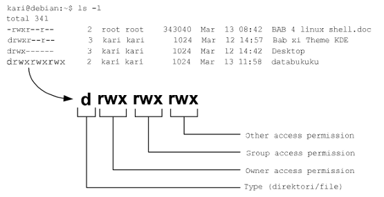
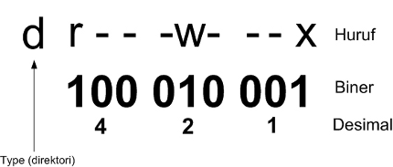

Pemilik, Hak Akses, dan Group
-----------------------------

GNU/Linux merupakan salah satu sistem operasi yang cukup aman (secure).
Seorang user dapat memproteksi file-filenya dan dapat menentukan user mana
saja yang dapat mengakses, membaca, dan merubah file tersebut. Saat sebuah
file dibuat dan disimpan oleh user, maka secara otomatis kepemilikannya
(owner) adalah user yang bersangkutan. Terdapat tiga macam hak akses dari
sebuah file, yaitu:

**Read:** mengizinkan user lain untuk membaca isi dari file tersebut tetapi user lain
tidak dapat melakukan perubahan isi file.

**Write:** mengizinkan kepada user lain untuk dapat membaca dan melakukan
perubahan terhadap isi file, termasuk menghapusnya.

**Execute:** mengizinkan user lain dapat mengeksekusi/menjalankan file (biasanya
berupa script atau program).

Pemberian hak akses kepada user dapat dilakukan secara individu (one by one)
oleh pemilik file. Pemberian hak akses kepada user lain seperti di atas masih
dapat dilakukan jika jumlah user masih terjangkau. Namun bagaimana halnya
jika jumlah user telah mencapai ratusan atau bahkan ribuan dalam sebuah
perusahaan. Sungguh bukan sebuah ide yang baik jika harus diberikan hak akses
satu per satu kepada user yang jumlahnya ribuan tadi. Masalah tersebut ternyata
telah terpikirkan oleh developer GNU/Linux dengan menciptakan manajemen
group yang di dalamnya dapat mencakup banyak user.

Selain hak akses yang dimiliki oleh sebuah file, sistem file GNU/linux juga
mengenal tiga buah mode akses terhadap direktori atau file. Adapun ketiga
mode akses tersebut, yaitu:

**Owner** 	: hak akses user pemilik direktori atau file.

**Group** 	: hak akses group tempat user tersebut berada.

**Other** 	: hak akses setiap user selain pemilik direktori atau file

Berikut rincian penjelasan mode akses dan hak akses terhadap sebuah file atau
direktori GNU/Linux.

	Pemilik, Hak akses dan group

Hak akses terhadap file juga dapat dikonversikan ke dalam bilangan biner dan
desimal seperti yang tampak pada tabel berikut.

======	=========
Nilai	Arti
======	=========
0	\- \- \-
1	\- \- x
2	\- w \-
3	\- w x
4	r \- \-
5	r \- x
6	r w \-
7	r w x
======	=========

Berikut aturan konversi hak akses *owner, group, dan other* dari huruf ke
bilangan biner dan desimal. Konversi ini nantinya akan berguna saat manajemen
user pada bab selanjutnya.

    	
    	Konversi hak akses
    	
    	
Berikut contoh kasus penerapan kepemilikan, hak akses, dan group pada sistem
file GNU/Linux.

Terdapat sebuah file dokumen keuangan pada perusahaan tertentu, sebutlah
perusahaan A. Dokumen ini dimiliki oleh salah satu karyawan divisi keuangan.
Secara otomatis file tersebut tentu saja hak kepemilikannya dimiliki oleh
karyawan yang bersangkutan. Ia berencana untuk memberikan hak akses
seluruh karyawan divisi keuangan tetapi tidak untuk karyawan divisi lain. Hak
akses yang diberikan ke divisi yang bersangkutan hanyalah akses untuk melihat
isi file dokumen saja tetapi tidak berhak untuk merubah isi dari file yang
bersangkutan. Sedangkan untuk hak execute tidak diperlukan karena filenya
bukanlah program atau script.

Bagaimana karyawan tersebut melakukan semua ini? Tentu saja bukanlah hal
yang sulit karena sistem operasi GNU/Linux menyediakan fasilitas perubahan
hak akses yang telah dijelaskan pada awal bab ini. Lebih jauh tentang perubahan
hak akses terhadap sebuah file akan dijelaskan pada bab manajemen user dan
hak akses.
